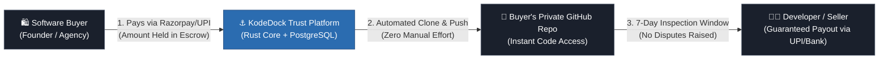
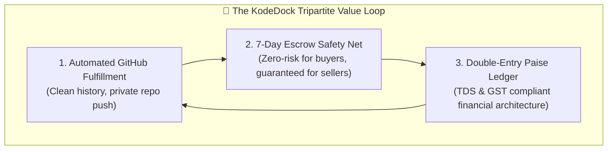
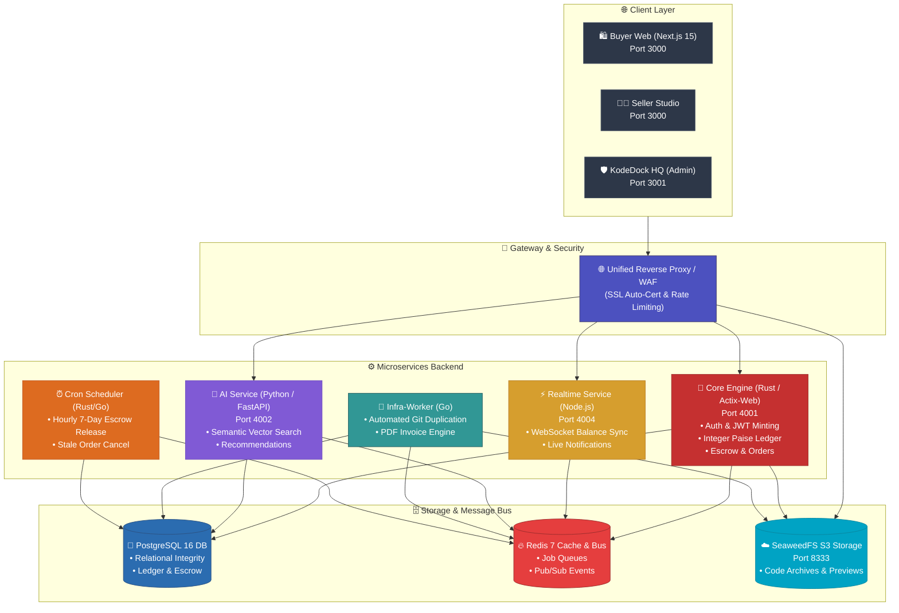
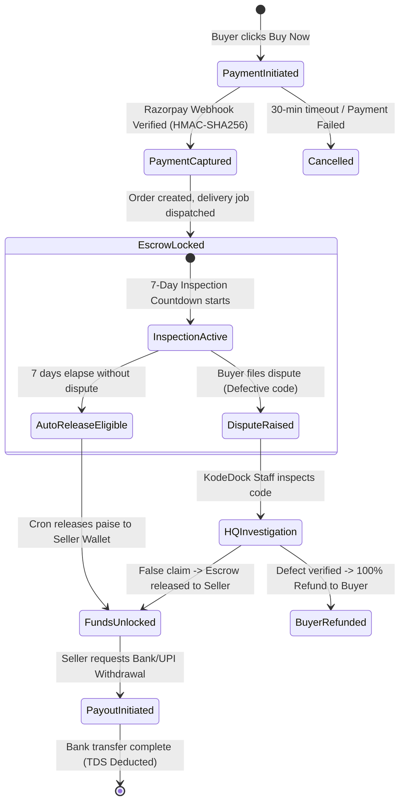
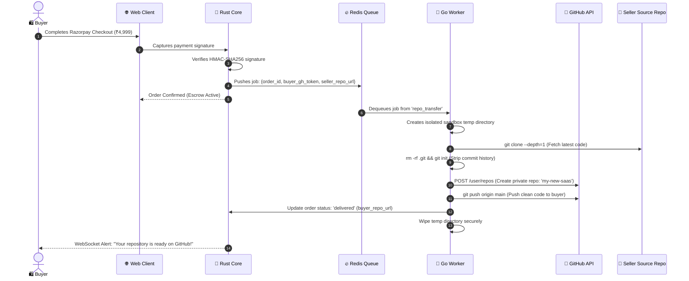
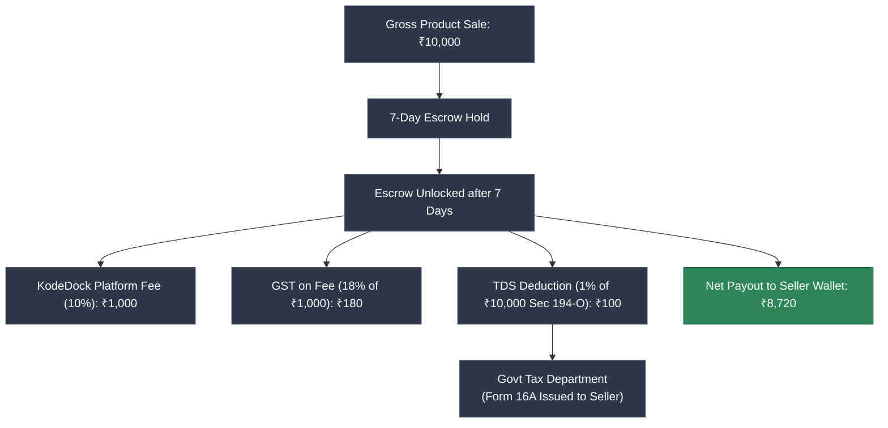
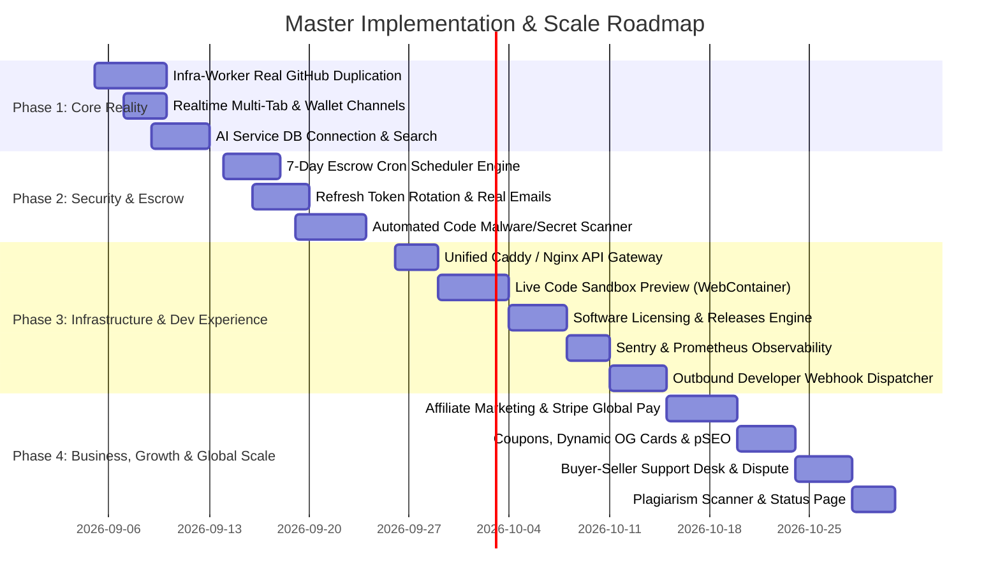

# ⚓ KodeDock — Executive Master Specification & Business Whitepaper
### *The Next-Generation Digital Code Marketplace & Trust-Engineered Software Escrow Platform*

---

> **Author / Founder:** KodeDock Team  
> **Target Audience:** Academic Reviewers (Professors/Universities), Startup Investors (Venture Capitalists/Angels), and Enterprise Partners.  
> **Status:** Production Architecture & Master Implementation Blueprint  
> **Date:** September 2026  

---

## 📑 Table of Contents
1. [Executive Summary & The 30-Second Elevator Pitch](#1-executive-summary--the-30-second-elevator-pitch)
2. [Market Opportunity & Macro Economic Impact](#2-market-opportunity--macro-economic-impact)
3. [The Core Problem: The Broken Software Marketplace Economy](#3-the-core-problem-the-broken-software-marketplace-economy)
4. [The KodeDock Solution & Value Proposition](#4-the-kodedock-solution--value-proposition)
5. [End-to-End System Architecture (Visual Topologies)](#5-end-to-end-system-architecture-visual-topologies)
6. [The Financial Trust Engine: 7-Day Escrow & Double-Entry Ledger](#6-the-financial-trust-engine-7-day-escrow--double-entry-ledger)
7. [Microservices Breakdown & Technical Implementation](#7-microservices-breakdown--technical-implementation)
8. [Automated Code Delivery & GitHub Pipeline](#8-automated-code-delivery--github-pipeline)
9. [Security, Anti-Fraud & Cryptographic Protocols](#9-security-anti-fraud--cryptographic-protocols)
10. [Legal, Taxation & Regulatory Compliance (Indian & Global)](#10-legal-taxation--regulatory-compliance-indian--global)
11. [Business Model, Monetization & Unit Economics](#11-business-model-monetization--unit-economics)
12. [Strategic 4-Phase Roadmap](#12-strategic-4-phase-roadmap)
13. [Conclusion & Founder's Vision](#13-conclusion--founders-vision)

---

## 1. Executive Summary & The 30-Second Elevator Pitch

**KodeDock** is an automated, trust-engineered digital marketplace and software escrow ecosystem designed for developers, agencies, and tech entrepreneurs to securely buy, sell, and instantly duplicate production-grade source code, SaaS boilerplates, AI templates, and digital software assets.



### 🎯 The Core Philosophy:
* **For Indian & Global Developers:** Shift from the exhausting hourly freelance treadmill ("trading time for money") to building scalable digital software assets that generate continuous, passive, recurring income in INR and USD.
* **For Buyers & Tech Startups:** Eliminate the fear of buying broken or pirated software through a guaranteed **7-Day Escrow Inspection Window** and instant repository delivery directly into their personal GitHub accounts.

---

## 2. Market Opportunity & Macro Economic Impact

### 🇮🇳 The Indian Developer Phenomenon
* India is home to **over 5.2 million software developers** (the 2nd largest developer population globally, projected to become #1 by 2027).
* Millions of freelance developers repeatedly write the same authentication flows, Razorpay integrations, SaaS dashboards, and mobile UI kits for different freelance clients.
* **The Lost Wealth:** When a freelance contract ends, that valuable codebase remains dormant in private folders instead of generating recurring royalty income.

### 📊 Competitive Landscape & Positioning

| Parameter | 🐌 Legacy Marketplaces (Envato / CodeCanyon) | 📦 Generic Digital Platforms (Gumroad / LemonSqueezy) | ⚓ KodeDock (Our Platform) |
| :--- | :--- | :--- | :--- |
| **Asset Delivery** | Raw `.zip` download (Prone to piracy & leak) | Generic file download link | **Automated GitHub Private Repo Duplication** |
| **Trust Guarantee** | ❌ No escrow (Difficult refund policies) | ❌ No escrow (Chargebacks hurt sellers) | **✅ 7-Day Trust Escrow Mechanism** |
| **Indian Payments** | ❌ High PayPal fees, bad INR conversion | ❌ Stripe-only (High failure on Indian cards) | **✅ Native UPI, Netbanking, Cards & Razorpay** |
| **Tax Compliance** | ❌ US withholding tax complications | ❌ Complex international sales tax | **✅ Automated 1% TDS (Sec 194-O) & B2B GST** |
| **Security Scanning**| 🟡 Manual slow review (weeks) | ❌ Zero code security inspection | **✅ Automated Secret & Malware Scanner** |
| **Code Previews** | Static screenshots / slow external demos | Static images | **✅ WebContainer In-Browser Live Sandbox** |

---

## 3. The Core Problem: The Broken Software Marketplace Economy

```
┌─────────────────────────────────────────────────────────────────────────────┐
│                             THE TRUST DEFICIT                               │
├──────────────────────────────────────┬──────────────────────────────────────┤
│ 😰 BUYER'S PAIN POINTS               │ 😡 SELLER'S PAIN POINTS              │
├──────────────────────────────────────┼──────────────────────────────────────┤
│ 1. "I pay ₹10,000 upfront, but the   │ 1. "I send my source code to client, │
│    code is broken, outdated, or fake"│    and they refuse payment or charge-│
│ 2. "Setting up from a messy .zip     │    back after downloading it."       │
│    takes days of debugging."         │ 2. "Global marketplaces charge 30-50%│
│ 3. "Code might have leaked API keys, │    fees and take 45 days to payout." │
│    backdoors, or security holes."    │ 3. "No way to provide clean updates  │
│ 4. "No invoice for GST tax credit."  │    when Next.js / Flutter upgrades." │
└──────────────────────────────────────┴──────────────────────────────────────┘
```

---

## 4. The KodeDock Solution & Value Proposition

KodeDock bridges this trust deficit through a **tripartite value loop**:



1. **Automated Private Repository Provisioning:** No manual email attachments or Google Drive links. The Go worker automatically clones the vendor repository, strips internal commit history, creates a private repository in the buyer's GitHub account, and transfers ownership within 3 seconds.
2. **7-Day Inspection Escrow:** Buyer funds remain locked in escrow. If the software is defective, the buyer opens a dispute. If verified, funds are refunded; otherwise, funds automatically unlock to the seller's wallet.
3. **Developer-First Monetization:** Transparent 10% platform fee, automated 1% Section 194-O TDS deduction, instant UPI/NEFT payouts, and lifetime version updates.

---

## 5. End-to-End System Architecture (Visual Topologies)

KodeDock is architected as an **independent microservices ecosystem** connected via a high-speed shared bridge network (`kodedock-network`) and Redis Pub/Sub event bus.



---

## 6. The Financial Trust Engine: 7-Day Escrow & Double-Entry Ledger

### 💰 Float-Free Integer Arithmetic
In high-volume fintech platforms, floating-point math (`0.1 + 0.2 = 0.30000000000000004`) causes disastrous rounding errors. KodeDock enforces **strict integer paise accounting** throughout all databases and microservices:
$$\text{Amount in INR} = \frac{\text{Amount in Paise}}{100}$$
* Example: A ₹4,999 codebase is stored as `499900` integer paise.

### 🔄 Escrow State Machine & Mathematical Model



---

## 7. Microservices Breakdown & Technical Implementation

### 🦀 1. Core Engine (Rust / Actix-Web / SQLx)
* **Path:** [`services/core-engine`](file:///home/ghost/Projects/Startup/KodeDock/services/core-engine)
* **Performance:** Sub-millisecond latency, zero-cost memory safety, compile-time SQL verification via `sqlx`.
* **Cryptographic Security:**
  - Password Hashing: **Argon2id** with random per-user salt.
  - Secret Encryption: **AES-256-GCM** authenticated encryption for storing OAuth tokens.
  - Rate Limiting: `actix-governor` with `ForwardedIpKeyExtractor` protection.

### 🐹 2. Infra-Worker (Go 1.22)
* **Path:** [`services/infra-worker`](file:///home/ghost/Projects/Startup/KodeDock/services/infra-worker)
* **Role:** High-concurrency background job processor consuming Redis `BLPop` queues.
* **Responsibilities:** Automated Git cloning, commit history truncation, GitHub API repo creation, PDF invoice generation, and S3 ZIP archive extraction.

### ⚡ 3. Realtime Service (Node.js / WebSockets)
* **Path:** [`services/realtime-service`](file:///home/ghost/Projects/Startup/KodeDock/services/realtime-service)
* **Role:** Multiplexed WebSocket server managing live buyer-seller transactional notifications and real-time wallet balance sync.
* **Architecture:** Attached to Redis Pub/Sub channels (`notifications`, `wallet_updates`, `order_updates`).

### 🧠 4. AI & Semantic Search Engine (Python / FastAPI)
* **Path:** [`services/ai-service`](file:///home/ghost/Projects/Startup/KodeDock/services/ai-service)
* **Role:** Natural language intent parser matching developer queries to codebase tags using vector embeddings (`all-MiniLM-L6-v2`) and PostgreSQL hybrid search.

### ☁️ 5. Storage Engine (SeaweedFS S3)
* **Path:** [`storage`](file:///home/ghost/Projects/Startup/storage)
* **Role:** Distributed, high-throughput S3-compatible object store compiled from local Go source, delivering lightning-fast downloads of multi-gigabyte code archives and preview assets.

---

## 8. Automated Code Delivery & GitHub Pipeline



---

## 9. Security, Anti-Fraud & Cryptographic Protocols

1. **HttpOnly Cookie Architecture (XSS Defense):** Authentication JWTs are never exposed to browser `localStorage` or clientside JavaScript; they are proxied via secure HttpOnly, SameSite=Strict cookies.
2. **TOCTOU-Safe Transactions (Double-Spending Defense):** All wallet balance mutations use PostgreSQL row-level locks (`SELECT ... FOR UPDATE`) within ACID transactions.
3. **Automated Secret & Malware Scanner:** Uploaded codebases pass through a automated static analyzer detecting leaked `.env` keys, private RSA keys, and malicious shell payloads.
4. **Abstract Syntax Tree (AST) Plagiarism Detection:** Protects original creators by flagging uploaded codebases that match public open-source repositories without transformative value.

---

## 10. Legal, Taxation & Regulatory Compliance (Indian & Global)

### 🇮🇳 Indian Regulatory Framework



1. **Section 194-O of the Income Tax Act:** E-commerce marketplaces in India must deduct 1% TDS on gross sales and file quarterly returns, generating automated Form 16A certificates for developers.
2. **B2B Input Tax Credit (ITC):** Real-time GSTIN validation allowing startups and software agencies to claim business expense tax credits on software purchases.
3. **Penny-Drop Bank Verification:** Prevents money laundering by executing ₹1 micro-deposits to confirm the seller's legal bank account name matches their PAN card before processing withdrawals.

---

## 11. Business Model, Monetization & Unit Economics

### 💵 Revenue Streams
1. **Marketplace Transaction Commission:** 10% to 15% platform fee on all standard codebase sales.
2. **Instant Sandbox Execution Engine:** ₹499/month for pro developers to offer live interactive in-browser WebContainer demos of their templates.
3. **Verified Creator Subscription:** ₹999/month for developer studio badges, priority search ranking, and instant 24-hour escrow release.
4. **Enterprise Multi-Seat Licenses:** 2.5x price multiplier for agency licenses allowing unlimited client deployments.

### 📈 Unit Economics & Scalability (Example on ₹5,000 Average Order Value)

```
Gross Merchandise Value (GMV):      ₹5,000.00
Platform Take Rate (12%):             ₹600.00
Server & Infrastructure Cost:          -₹12.00  (Rust & SeaweedFS efficiency)
Payment Gateway Fee (Razorpay 2%):    -₹100.00
------------------------------------------------
Net Contribution Margin:              ₹488.00  (~81.3% Gross Margin on Revenue)
```

---

## 12. Strategic 4-Phase Roadmap



---

## 13. Conclusion & Founder's Vision

**KodeDock** is more than a marketplace; it is an economic catalyst for software creators.

By combining the **raw speed of Rust**, the **distributed automation of Go**, the **real-time connectivity of Node.js**, and the **rigor of a 7-day escrow financial trust engine**, KodeDock eliminates code piracy and transaction anxiety. 

It empowers millions of talented developers to monetize their intellectual property, transition from hourly service labor to digital asset wealth, and deliver verified, high-quality software to founders worldwide.

---
*© 2026 KodeDock Inc. All Rights Reserved. Confidential & Proprietary Specification.*
