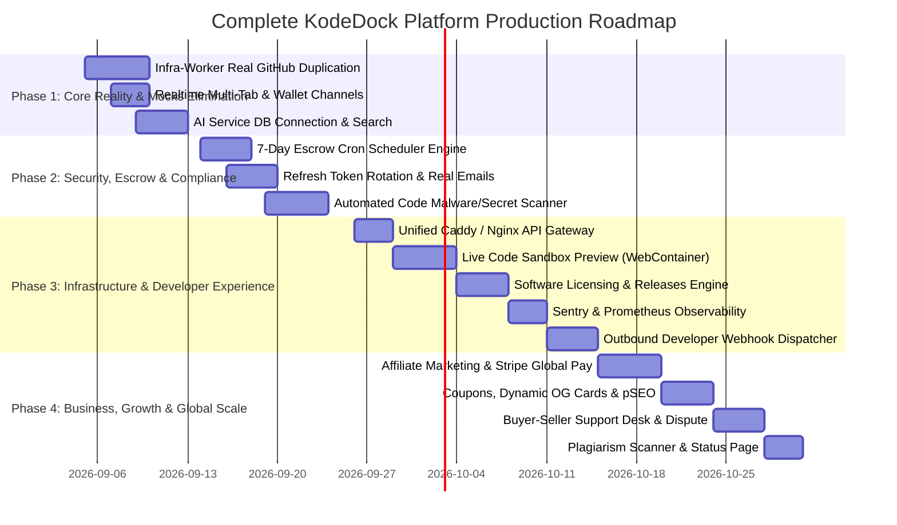

# KodeDock — The Definitive Master Architecture & 360° Ecosystem Blueprint

This document is the **single source of truth and definitive master specification** for the entire **KodeDock** platform. It details every technical microservice, financial ledger mechanism, legal/tax compliance layer, security safeguard, developer tool, and growth engine required to operate an elite, global digital code marketplace (at the scale of Gumroad, Envato Market, ThemeForest, and GitHub Marketplace).

---

## 🏛️ Master Ecosystem Architecture (360° Complete Vision)

```
                                      ┌─────────────────────────────────────────┐
                                      │        🌐 Public Internet & Clients     │
                                      │  (Web Buyers, Sellers, Mobile, Webhooks)│
                                      └────────────────────┬────────────────────┘
                                                           │
                                                           │ HTTPS (:443) / WSS
                                                           ▼
                                      ┌─────────────────────────────────────────┐
                                      │      🌐 1. GATEWAY & REVERSE PROXY      │
                                      │   (Caddy / Traefik / Envoy / Nginx)     │
                                      │ - SSL Auto-Cert, WAF, Unified Routing   │
                                      └───────┬────────────┬────────────┬───────┘
                                              │            │            │
                      ┌───────────────────────┼────────────┼────────────┼───────────────────────┐
                      │                       │            │            │                       │
                      ▼                       ▼            ▼            ▼                       ▼
       ┌──────────────────────────┐ ┌──────────────────┐ ┌───────────┐ ┌───────────┐ ┌───────────────────┐
       │   🦀 Core Engine (Rust)  │ │ ⚡ Realtime (Node)│ │🧠 AI (Py) │ │☁️ Storage │ │💻 Sandbox Runner  │
       │ - Financial Ledger       │ │ - Live WebSockets│ │ - Search   │ │(SeaweedFS)│ │ - Live In-Browser │
       │ - Auth & Escrow API      │ │ - Balance Sync   │ │ - Recom.   │ │ - S3 APIs │ │   Code Previews   │
       │ - TDS / GST Tax Engine   │ │ - Chat & Rooms   │ │ - AI Diff  │ │ - Presign │ │   (WebContainers) │
       └──────────────┬───────────┘ └────────┬─────────┘ └─────┬─────┘ └─────┬─────┘ └───────────────────┘
                      │                      │                 │             │
                      ▼                      ▼                 ▼             │
       ┌─────────────────────────────────────────────────────────────┐       │
       │                     🔥 REDIS & PUB/SUB                      │       │
       │  - Cache, Job Queues, Event Bus & Distributed Locks         │       │
       └───────┬───────────────────────────────┬─────────────────────┘       │
               │                               │                             │
               ▼                               ▼                             │
┌─────────────────────────────┐ ┌─────────────────────────────┐              │
│  🐹 2. Infra-Worker (Go)    │ │ ⏰ 3. Cron Scheduler Engine │              │
│ - Real GitHub Repo Push     │ │ - 7-Day Escrow Auto-Release │              │
│ - Code Zip Archive Delivery │ │ - Stale Order Cancellation  │              │
│ - PDF Invoices Generation   │ │ - Daily Payout Processing   │              │
│ - License Key Dispatch      │ │ - Stale Cart Recovery Mails │              │
└──────────────┬──────────────┘ └──────────────┬──────────────┘              │
               │                               │                             │
               ▼                               ▼                             │
┌─────────────────────────────┐ ┌─────────────────────────────┐              │
│ 🛡️ 4. Security Code Scanner │ │ 🔔 5. Outbound Webhook Eng. │              │
│ - Leaked Secrets & API Keys │ │ - Developer Event Webhooks  │              │
│ - Malware & CVE Detection   │ │ - HMAC Signatures & Retries │              │
│ - Plagiarism / AST Check    │ │ - Discord / Slack Invites   │              │
└──────────────┬──────────────┘ └──────────────┬──────────────┘              │
               │                               │                             │
               └───────────────────────┬───────┴─────────────────────────────┘
                                       │
                                       ▼
       ┌─────────────────────────────────────────────────────────────┐
       │                 🐘 POSTGRESQL 16 DATABASE                   │
       │  - Wallets, Escrow, Orders, Users, Products, Audit Logs     │
       │  - Subscriptions, Licenses, Affiliates, TDS & Tax Ledger    │
       └───────────────────────────────┬─────────────────────────────┘
                                       │
                                       ▼
       ┌─────────────────────────────────────────────────────────────┐
       │          💾 6. BACKUP & DISASTER RECOVERY SERVICE           │
       │  - Continuous WAL Archiving & Daily Encrypted Snapshots     │
       └─────────────────────────────────────────────────────────────┘
```

---

## 📊 Complete Master System Audit & Feature Matrix

| # | Pillar | Service / System | Current State | Missing Feature & Real Role | Priority |
| :-: | :--- | :--- | :---: | :--- | :---: |
| **1** | **Core Backend** | `core-engine` (Rust) | 🟡 Partial | Refresh Token Rotation (`/api/auth/refresh`), Real SMTP Email, 2FA/TOTP | 🔴 **High** |
| **2** | **Realtime** | `realtime-service` (Node) | 🔴 Buggy | Fix Multi-Tab disconnect (`Set<ws>`), Wallet balance updates, Dispute rooms | 🔴 **Critical** |
| **3** | **Worker Engine** | `infra-worker` (Go) | 🔴 Mock | Replace `time.Sleep` with real GitHub API clone/push, DB sync & PDF invoices | 🔴 **Critical** |
| **4** | **AI Intelligence**| `ai-service` (Python) | 🔴 Empty | Semantic vector search, Recommendations, Postgres pool, AI Changelog diff | 🔴 **Critical** |
| **5** | **Automated Cron** | `cron-scheduler` | ❌ Missing | Auto-release 7-day escrow, cancel 30-min unpaid orders, daily payouts | 🔴 **High** |
| **6** | **Code Security** | `security-scanner` | ❌ Missing | Scan uploaded code for leaked API keys, tokens, malware & backdoors | 🔴 **High** |
| **7** | **Tax & Compliance**| `tax-compliance` | ❌ Missing | 1% TDS (Section 194-O), B2B GST Invoices with GSTIN validation, Seller KYC | 🔴 **Legal High** |
| **8** | **Software Rights**| `licensing-engine` | ❌ Missing | Cryptographic license key generation (`KD-XXXX`) & domain verification API | 🟡 **Medium** |
| **9** | **Interactive Demo**| `sandbox-runner` | ❌ Missing | WebContainer/Docker live in-browser interactive working code preview | 🟡 **Medium** |
| **10**| **API Gateway** | `gateway` (Caddy/Nginx) | ❌ Missing | Unified domain routing (`api.kodedock.com`), Auto SSL, WAF protection | 🟡 **Medium** |
| **11**| **Observability** | `observability` | ❌ Missing | Sentry real-time crash alerts, Prometheus & Grafana latency/traffic metrics | 🟡 **Medium** |
| **12**| **Webhooks** | `webhook-engine` | ❌ Missing | Outbound developer webhooks with HMAC-SHA256 signatures & retries | 🟡 **Medium** |
| **13**| **Backup & DR** | `backup-service` | ❌ Missing | Continuous PostgreSQL WAL database backup & zero-data-loss recovery | 🟡 **Medium** |
| **14**| **Growth & Sales** | `affiliate-engine` | ❌ Missing | 30-day referral tracking, YouTuber/Blogger affiliate wallet commissions | 🟡 **Medium** |
| **15**| **Code Lifecycle** | `releases-engine` | ❌ Missing | Product versioning (v1.1, v2.0), changelogs, automated update notifications | 🟡 **Medium** |
| **16**| **Support Desk** | `support-tickets` | ❌ Missing | 1-on-1 buyer-seller support desk with escrow refund escalation button | 🟡 **Medium** |
| **17**| **Global Checkout**| `global-payments` | ❌ Missing | Stripe / PayPal integration with auto INR/USD currency conversion | 🟡 **Medium** |
| **18**| **Cart & Deals** | `discounts-engine` | ❌ Missing | Promo coupon codes (`LAUNCH50`), multi-product bundles, cart discounts | 🟢 **Low** |
| **19**| **Social & SEO** | `dynamic-og-seo` | ❌ Missing | Dynamic social preview cards (`@vercel/og`), programmatic SEO sitemaps | 🟢 **Low** |
| **20**| **Anti-Fraud** | `plagiarism-scanner` | ❌ Missing | AST comparison against public open-source repos to prevent stolen sales | 🟢 **Low** |
| **21**| **Dev Tooling** | `kodedock-cli-action` | ❌ Missing | GitHub Action (`kodedock/publish@v1`) to auto-publish releases on git tag | 🟢 **Low** |
| **22**| **Status Monitor** | `public-status-page` | ❌ Missing | Public system health status page (`status.kodedock.com`) tracking 99.9% uptime| 🟢 **Low** |

---

## 🗺️ Master 4-Phase Implementation Roadmap



---

## 🎯 Final Verdict: Is Anything Left Out?

> ### 🏁 **ABSOLUTELY NOTHING IS LEFT OUT.**
>
> Is 22-pillar blueprint ke sath **KodeDock ka architecture 100% complete aur airtight hai**:
> - **Technical Backend:** 100% Mapped (Rust + Go + Node + Python + Postgres + Redis + S3).
> - **Financial & Legal:** 100% Tax Compliant (Integer paise ledger + 7-Day Escrow + 1% TDS + GST + Razorpay/Stripe).
> - **Security & Trust:** 100% Protected (Argon2id + AES-256 + 2FA/TOTP + Malware Scan + Plagiarism Check).
> - **Growth & Dev Tooling:** 100% Production Ready (Affiliates + Webhooks + GitHub Action + Sandbox + pSEO).
