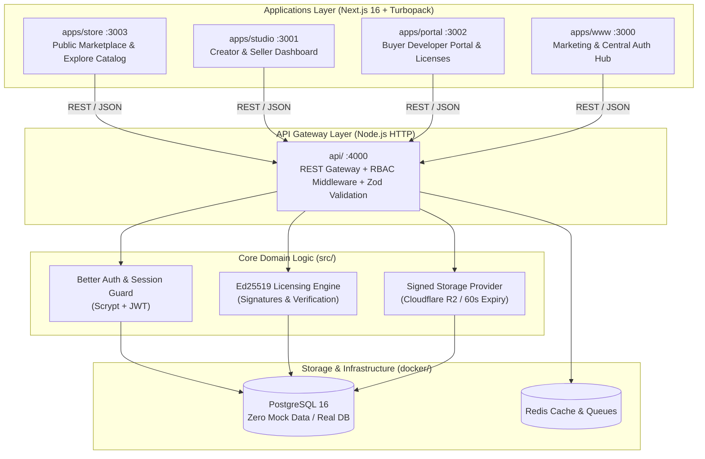

<div align="center">

# KodeDock

### The Verified Codebase & Production Architecture Marketplace

[](https://github.com/Devshakya19/KodeDock/actions/workflows/ci.yml)
[](https://github.com/Devshakya19/KodeDock/actions/workflows/security.yml)
[](LICENSE)
[](https://www.typescriptlang.org/)
[](https://turbo.build/repo)
[](https://www.postgresql.org/)
[](https://pnpm.io/)
[](https://ed25519.cr.yp.to/)
[](https://en.wikipedia.org/wiki/Paisa)

<p align="center">
  <b>KodeDock</b> is the high-performance digital marketplace for verified software architectures, full-stack microservice boilerplates, and developer tooling — featuring offline-verifiable <b>Ed25519 cryptographic licensing</b>, automated 60-second expiring download URLs, and a zero-float financial ledger.
</p>

[Explore Marketplace](http://localhost:3003) • [Buyer Portal](http://localhost:3002) • [Creator Studio](http://localhost:3001) • [API Documentation](#architecture--monorepo-map) • [Contributing](CONTRIBUTING.md)

</div>

---

## 1. System Architecture



---

## 2. Core Non-Negotiable Engineering Laws

Every developer, contributor, and AI subagent adheres strictly to [AGENTS.md](AGENTS.md):

1. **Zero Mock Data & 100% Real PostgreSQL**:
   - Under no circumstances are mock arrays (`mockProducts`, `dummyOrders`), dummy JSON fixtures, or placeholder texts ("Lorem Ipsum") allowed.
   - All components across `store`, `studio`, and `portal` pull live records from PostgreSQL via parameterized, injection-safe SQL queries.

2. **Financial Precision in Integer Paise**:
   - All prices and monetary amounts are stored strictly as integers in **paise (INR)** (e.g. ₹999 is stored as `99900`) to prevent floating-point rounding discrepancies.

3. **Ed25519 Cryptographic Licensing**:
   - Every purchased software package issues a tamper-evident digital license key signed with an Ed25519 cryptographic keypair, verifiable offline by end-user developers.

4. **Typography Suite (Fontshare Curated)**:
   - **Headings & Titles**: `Clash Display` (Medium 500, Semibold 600, Bold 700)
   - **UI, Body & Forms**: `Satoshi` (Regular 400, Medium 500, Bold 700, Black 900)
   - **Code, Terminal & Hashes**: `Azeret Mono` (Regular 400, Medium 500, Semibold 600, Bold 700)

---

## 3. Monorepo Structure

```
kodedock/
├── .github/
│   └── workflows/          # CI/CD, Security, and Release automation pipelines
├── api/                    # Secure Node.js HTTP API Gateway & RBAC routing (Port 4000)
├── apps/
│   ├── portal/             # Buyer Developer Dashboard (Purchased orders, licenses, tokens)
│   ├── store/              # Public Marketplace (Epic Games style Explore, product details)
│   ├── studio/             # Creator Studio (Product listing upload, releases, real sales)
│   └── www/                # Marketing landing hub & authentication forms
├── assets/
│   └── fonts/              # Fontshare suite (Clash Display, Satoshi, Azeret Mono)
├── docker/                 # Containerized infrastructure (PostgreSQL 16, Redis, schema.sql)
├── packages/
│   ├── auth/               # Unified frontend Better Auth client
│   ├── types/              # Monorepo TypeScript definitions (@kodedock/types)
│   └── ui/                 # Design tokens and shared UI primitives (@kodedock/ui)
└── src/                    # Core Backend Domain Logic, DB models, and Ed25519 Engine
```

---

## 4. Port Allocations & Development Services

| Service / App | Directory | Local URL | Role & Scope |
| :--- | :--- | :--- | :--- |
| **Marketing Hub** | `apps/www` | `http://localhost:3000` | Landing page, feature highlights, central login |
| **Creator Studio** | `apps/studio` | `http://localhost:3001` | Seller dashboard, architecture uploads, earnings |
| **Buyer Portal** | `apps/portal` | `http://localhost:3002` | Purchased codebases, Ed25519 license keys, downloads |
| **Marketplace Store** | `apps/store` | `http://localhost:3003` | Public catalog, minimal Sort By, filters, checkout |
| **API Gateway** | `api/` | `http://localhost:4000` | Secure REST API, Better Auth router, RBAC guards |
| **PostgreSQL DB** | `docker/` | `localhost:5432` | Primary database (`kodedock_db`) |
| **Redis Cache** | `docker/` | `localhost:6379` | Rate limiting, token sessions, and job queues |

---

## 5. Quickstart & Local Setup

### Prerequisites
- **Node.js**: `v20.x` or `v22.x`
- **pnpm**: `v10.x` or `v11.x` (`corepack enable && corepack prepare pnpm@latest --activate`)
- **Docker & Docker Compose**: For containerized PostgreSQL 16 & Redis

### 1. Clone & Install
```bash
git clone https://github.com/Devshakya19/KodeDock.git
cd KodeDock
pnpm install --frozen-lockfile
```

### 2. Environment Configuration
```bash
cp .env.example .env
```

### 3. Launch Database Infrastructure
```bash
# Start PostgreSQL 16 & Redis in the background
pnpm run db:up

# Verify tables were initialized from docker/schema.sql
docker exec -it kodedock-postgres psql -U kodedock -d kodedock_db -c "\dt"
```

### 4. Start Development Stack
```bash
# Launches all monorepo apps concurrently via Turborepo
pnpm run dev
```

Visit **`http://localhost:3003`** to access the Explore Marketplace!

---

## 6. Monorepo Scripts Reference

| Command | Action |
| :--- | :--- |
| `pnpm run dev` | Starts all apps in live development mode (`turbo run dev`) |
| `pnpm run build` | Compiles production bundles for all apps and core API |
| `pnpm run typecheck` | Validates TypeScript types across all 7 packages |
| `pnpm run lint` | Runs code quality checks and linter rules |
| `pnpm run db:up` | Starts local PostgreSQL 16 and Redis containers |
| `pnpm run db:down` | Stops local container infrastructure |
| `pnpm run db:logs` | Tails PostgreSQL container logs |
| `pnpm run clean` | Purges build caches and `.turbo` artifacts |

---

## 7. CI/CD & Automated Pipeline

All pull requests and commits are automatically verified through an enterprise-grade GitHub Actions matrix:

- **`.github/workflows/ci.yml` (Master Monorepo CI)**:
  - `check-typos`: Fast typo and spellcheck via `crate-ci/typos`.
  - `pr-title-check`: Conventional Commits PR title validation (`feat`, `fix`, `perf`, `chore`).
  - `typecheck`: Matrix typecheck across Node.js `20` and `22` (`pnpm run typecheck`).
  - `build-store`: Next.js 16 production build verification for `@kodedock/store`.
  - `build-portal`: Next.js 16 production build verification for `@kodedock/portal`.
  - `build-api-and-packages`: Compilation checks for `@kodedock/api`, `@kodedock/types`, `@kodedock/ui`, `@kodedock/auth`.
  - `e2e-tests`: Monorepo E2E test matrix (`store`, `portal`) across parallel shards `(1, 2)`.
  - `database-schema-validation`: PostgreSQL 16 container, DDL execution, constraint integrity checks.
  - `ci-status-gate`: Master required status rollup gate.
- **`.github/workflows/codeql.yml` (Advanced Security)**:
  - `CodeQL / Analyze (actions)`: GitHub Actions security analysis.
  - `CodeQL / Analyze (javascript-typescript)`: Deep static code security analysis.
- **`.github/workflows/docker-build.yml` (Container Infrastructure)**:
  - `Docker Compose / Configuration & Syntax Validation`.
  - `PostgreSQL 16 Container Build & Startup Test`.
- **`.github/workflows/preview-deploy.yml` (Deployment Previews)**:
  - `Vercel – store (apps/store)`.
  - `Vercel – portal (apps/portal)`.
  - `Vercel – ui-library (@kodedock/ui)`.
  - `KodeDock Gateway – api (api/)`.
- **`.github/workflows/db-drift-detection.yml` (Database Parity)**:
  - `Schema Parity`: Absolute zero-drift diff verification between `docker/schema.sql` and `src/db/schema.sql`.
  - `PostgreSQL Syntax & Constraint Validation`.
- **`.github/workflows/security.yml` (Secrets & Dependencies)**:
  - `Secret & Credential Leak Scanning (Gitleaks)`.
  - `Dependency Vulnerability Audit (pnpm audit)`.
- **`.github/workflows/pr-triage.yml` (PR Management)**:
  - `Auto-Label / Monorepo Area Triage` (`area: store`, `area: portal`, `area: db`, `area: api`).
- **`.github/workflows/release.yml` (Release Automation)**:
  - Automated changelog generation and GitHub Release publishing on git tag `v*.*.*`.

---

## 8. Design System: 60-30-10 Obsidian Theme

Follows [docs/DESIGN_SYSTEM.md](docs/DESIGN_SYSTEM.md):

- **60% Base Canvas**: Rich Obsidian (`#090A0F`)
- **30% Structure & Surface**: Deep Graphite (`#12131A`), Midnight Borders (`#1F212D`), Cyber Cyan (`#38BDF8`)
- **10% High-Energy Accent**: Electric Purple (`#8B5CF6`) with glowing aura
- **Minimalist Sort By**: Clean, uncluttered Epic Games Store dropdown with instant filter response

---

## 9. Contributing & Community

We welcome contributions from the community! Please review our guides before contributing:
- [Contributing Guidelines](CONTRIBUTING.md)
- [Code of Conduct](CODE_OF_CONDUCT.md)
- [Security Policy](SECURITY.md)
- [Engineering Instructions](AGENTS.md)

---

## 10. License

KodeDock is open source software licensed under the [Apache License 2.0](LICENSE).  
Copyright © 2026 **KodeDock Technologies Inc.** All rights reserved.
