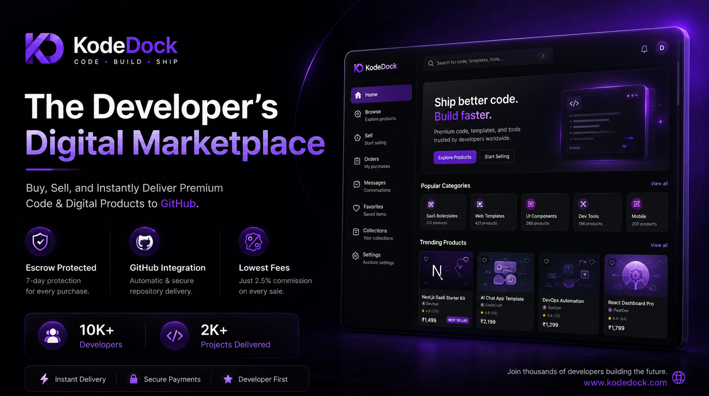
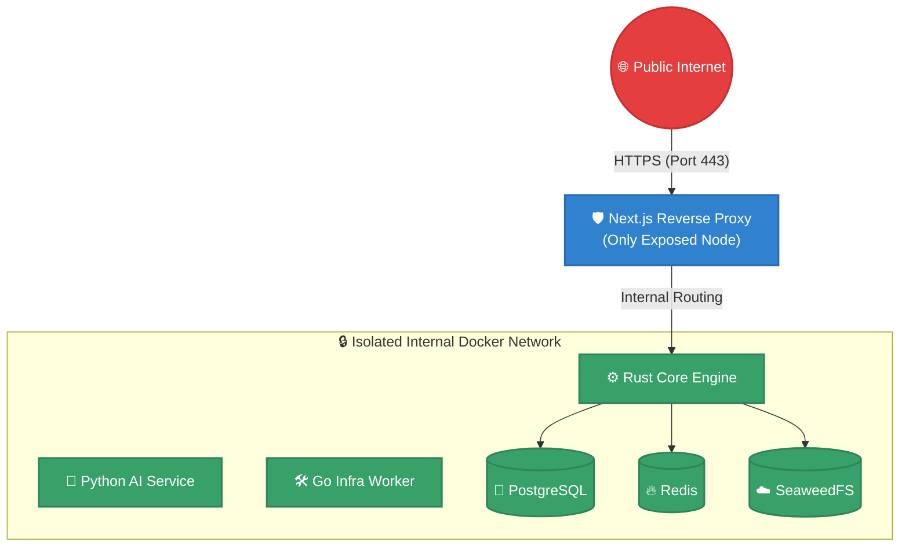
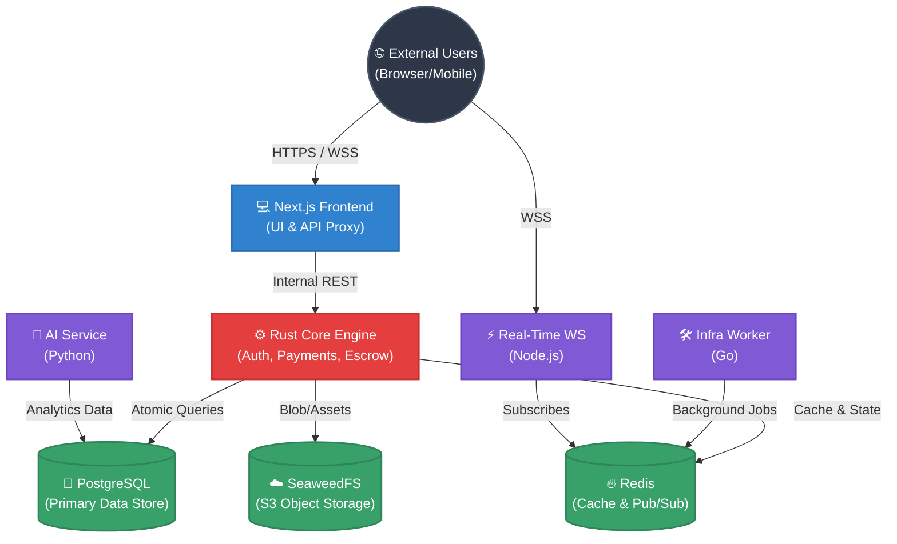
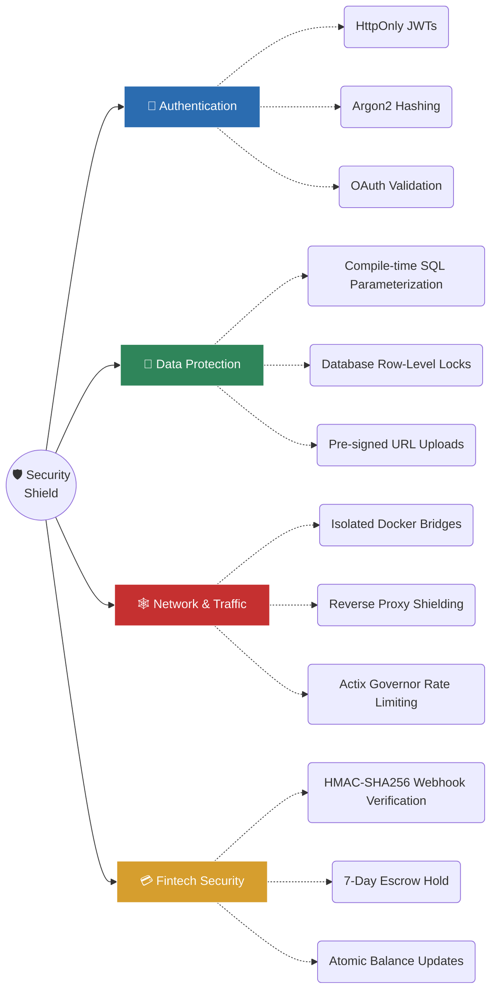

<h1 align="center">
  
  &nbsp;
  
</h1>

<h3 align="center">India's Digital Code Marketplace</h3>

  <picture>
    <source media="(prefers-color-scheme: light)" srcset="assets/banner.png">
    
  </picture>

  
  
  
  
  
  

> **🔓 OPEN SOURCE SOFTWARE** — This repository is licensed under the MIT License.
> You are free to use, copy, modify, merge, publish, distribute, sublicense, and/or sell copies of the Software.
> See [LICENSE](LICENSE) for full terms.

---

## Table of Contents

- [Overview](#overview)
- [How It Works](#how-it-works)
- [Access & Security](#access--security)
- [Key Features](#key-features)
- [Tech Stack](#tech-stack)
- [Architecture](#architecture)
- [Service Responsibilities](#service-responsibilities)
- [Security Mitigations](#security-mitigations)
- [Documentation](#documentation)
- [Contributors](#contributors)
- [License](#license)

---

## Overview

**KodeDock** is India's premier digital code marketplace connecting developers who build production-grade code assets with businesses and developers who need them. Unlike traditional platforms that distribute static `.zip` archives, KodeDock delivers purchased code directly to buyers' private GitHub repositories — providing a seamless, version-controlled experience from day one.

The platform is built on a highly optimized polyglot microservices architecture. It leverages the raw performance of Rust for its financial core, Next.js for a premium frontend experience, Go for background automation, Python for AI-driven recommendations, and Node.js for real-time WebSocket capabilities.

---

## How It Works

1. 📤 **Sellers Upload:** Developers upload their code repositories or link their private GitHub repos to the platform.
2. 🛒 **Buyers Purchase:** Buyers browse the marketplace, review products, and purchase them securely via Razorpay (INR-native).
3. 🔒 **Escrow Protection:** Funds are held in a secure database escrow for 7 days. If a dispute is raised, admins intervene. Otherwise, the funds are automatically released to the seller's wallet.
4. 🚀 **Instant Delivery:** Upon successful payment, KodeDock's background infrastructure automatically duplicates the purchased codebase into the buyer's GitHub account as a private repository.

---

## Access & Security

KodeDock is designed **security-first** across every layer of the stack. To prevent external tampering, the platform utilizes strict network segmentation and deep defense mechanisms.

### Network Topology & Access

- **Public Entry Points:** Only the main web interface (Next.js proxy) and WebSocket endpoints are exposed securely.
- **Internal Microservices:** All backend services operate exclusively on an **isolated, internal Docker bridge network**. They are completely invisible to the public internet and can only be accessed through authorized internal routing from the proxy.
- **Database/Cache Isolation:** PostgreSQL, Redis, and SeaweedFS instances do not expose their connection protocols outside the internal container network.

---

## Key Features

KodeDock packs powerful features to ensure a premium experience for both buyers and sellers:

| Feature Category | Capabilities & Details |
|-----------------|------------------------|
| 🔐 **Identity & Auth** | • **HttpOnly JWTs:** Tokens never exposed to JS. • **Argon2 Hashing:** GPU-resistant password security. • **GitHub OAuth:** 1-click secure onboarding. • **RBAC:** Multi-tier user/developer/admin roles. |
| 💳 **Fintech & Escrow** | • **Razorpay Integration:** Native INR payments & top-ups. • **Atomic Transactions:** DB-level row locks prevent double spending. • **7-Day Escrow Hold:** Funds held securely to protect buyers. • **Low Commission:** 2.5% platform fee. |
| 📦 **Code Delivery** | • **GitHub Repo Duplication:** Buyers receive code as private repos, not zip files. • **Deferred Uploads:** Images & assets upload directly to S3 storage via pre-signed URLs only upon publish. |
| 💬 **Engagement** | • **Real-time Notifications:** WebSockets via Redis Pub/Sub. • **Seller Reviews:** Analytics, average rating, star distributions, and buyer feedback. • **Live Dashboards:** Auto-polling sales counters and wallet balances. |
| 🤖 **AI Intelligence** | • **Smart Search:** FastAPI-powered semantic searching. • **Personalization:** Algorithmic product recommendations *(In Development)*. |

---

## Tech Stack

We utilize a Polyglot Microservices architecture, selecting the best language for each specific job:

### 🌐 Frontend & UI
-  **Next.js 15 (React 19)** – Server-Side Rendering (SSR), SEO, and secure API Proxying.
-  **Tailwind CSS v4** & **shadcn/ui** – Premium, glassmorphic design system.

### ⚙️ Backend & Microservices
-  **Rust (Actix-Web & SQLx)** – The Core Engine. Blazing fast, memory-safe handling of payments, auth, and DB transactions.
-  **Python (FastAPI)** – AI Service for smart search and data modeling.
-  **Go** – Infra Worker. Concurrent execution of background tasks and GitHub API automations.
-  **Node.js (ws)** – High-concurrency WebSocket server for real-time notifications.

### 🗄️ Infrastructure & Storage
-  **PostgreSQL 16** – Primary relational data store with advanced triggers.
-  **Redis 7** – High-speed caching and inter-service Pub/Sub message broker.
-  **SeaweedFS** – S3-compatible, ultra-fast distributed object storage for images and codebase binaries.
-  **Docker Compose** – Containerized environment orchestration.

---

## Architecture

The system operates across highly isolated microservices that communicate through strict internal bridges. 

---

## Service Responsibilities

To maintain a secure, decoupled ecosystem, each service acts independently within the private cluster.

| Service | Technology Focus | Core Responsibility |
|---------|------------------|---------------------|
| 💻 **Frontend Proxy** | TypeScript / Next.js | Serves as the public-facing application and Secure API Proxy. Manages HttpOnly cookies to defend against XSS, shielding backend tokens from browser exposure. |
| ⚙️ **Core Engine** | Rust / Actix-Web | The heart of the platform. Handles JWT verification, wallet balances, escrow locks, product CRUD, and high-stakes database transactions safely with zero data races. |
| 🧠 **AI Service** | Python / FastAPI | Powers intelligent marketplace features, including semantic search, product recommendations, and automated fraud detection signals. |
| 🛠️ **Infra Worker** | Go | Handles long-running background tasks securely, including interacting with the GitHub API to automate repository duplication and syncs for buyers. |
| ⚡ **Real-Time WS** | Node.js / ws | Dedicated WebSocket handler. Listens to internal Redis Pub/Sub channels to push real-time notifications to users globally with minimal latency. |

---

## Security Mitigations

We employ rigorous security measures to protect users, creators, and financial transactions.

### 🛡️ Threat Mitigations Details

| 🚨 Threat Scenario | 🛡️ Mitigation Implementation | 🔍 Deep Dive |
|-------------------|---------------------------|-------------|
| **XSS (Cross-Site Scripting)** | **HttpOnly JWTs** | Tokens are completely invisible to browser JavaScript, negating payload extraction. |
| **Brute Force / Rainbow Tables** | **Argon2 Hashing** | Uses GPU/ASIC-resistant memory-hard hashing for maximum password security. |
| **SQL Injection (SQLi)** | **SQLx Parameterization** | Enforces compile-time parameterized queries across all Rust handlers; raw strings are never executed. |
| **DDoS / API Spam** | **Actix-Governor** | Enforces strict, IP-based rate limiting on sensitive endpoints (e.g., Auth, Uploads, Checkout). |
| **Payment Spoofing** | **HMAC-SHA256 Verification** | Payment webhooks are validated using constant-time string comparison to prevent timing attacks. |
| **Race Conditions / Double Spends** | **Atomic DB Transactions** | Wallet updates use atomic `FOR UPDATE` row locks in PostgreSQL to ensure sequential ledger updates. |
| **Malicious File Uploads** | **Pre-signed URLs** | Uploads bypass backend APIs and go directly to SeaweedFS via temporary, size-restricted pre-signed URLs. |

To report a security vulnerability, please email **security@kodedock.com**. See [SECURITY](SECURITY) for our responsible disclosure policy.

---

## Documentation

KodeDock maintains comprehensive documentation for developers, contributors, and auditors.

| Area | Documentation Link | Description |
|------|-------------------|-------------|
| 📖 **API** | [API_REFERENCE.md](API_REFERENCE.md) | Complete REST API reference, endpoints, payloads, and response codes. |
| 🛡️ **Security** | [SECURITY.md](SECURITY.md) | Detailed breakdown of our security architecture, threat models, and policies. |
| 📝 **Changelog** | [CHANGE.md](CHANGE.md) | Ongoing log of platform updates, bug fixes, and feature additions. |
| 🤝 **Contributing** | [CONTRIBUTING.md](CONTRIBUTING.md) | Guidelines for contributing code, architecture standards, and team info. |

---

## Contributors

<!-- readme: contributors -start -->

   

<!-- readme: contributors -end -->

---

## License

This project is licensed under the **MIT License**.

- You are free to use, modify, and distribute this software
- See [LICENSE](LICENSE) for the complete license agreement
- General inquiries: **hello@kodedock.com**

---

Built with passion for the Indian developer community 🇮🇳

