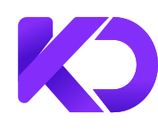
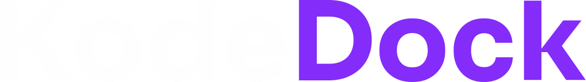
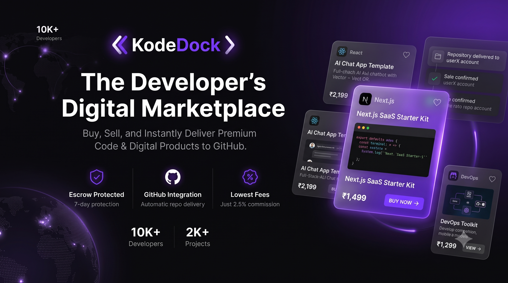

<h1 align="center">
  
  &nbsp;
  
</h1>

<p align="center">
  
</p>

<p align="center">
  <strong>The High-Performance, Zero-Crash Marketplace for Source Code, 3D Assets, Design Systems & Developer Tooling.</strong>
</p>

<p align="center">
  <a href="#-key-features"></a>
  <a href="#-tech-stack"></a>
  <a href="#-tech-stack"></a>
  <a href="#-deployment"></a>
  <a href="LICENSE"></a>
</p>

---

## 📖 Overview

**KodeDock** is a high-throughput, bank-grade digital marketplace designed for software engineers, 3D artists, and creators. It combines:
- **7-Day Financial Escrow:** Automated buyer protection with double-entry integer paise accounting (`i64`).
- **Zero-Server-Cost Live Sandboxes:** In-browser WebAssembly WebContainers (`@webcontainer/api`) allowing buyers to test codebases live in their browser before purchasing.
- **360° 3D Mesh Inspection:** In-browser interactive 3D model viewer for Blender (`.blend`), FBX, and OBJ game assets.
- **Automated Tax Compliance:** 1% Indian Section 194-O TDS deduction, GST calculation, and automated PDF tax invoices.
- **AST Secret & Vulnerability Scanner:** Pre-publish code analysis using Tree-Sitter and Aho-Corasick regex to catch leaked credentials.
- **Creator-First Economics:** Low 2.5% – 5.0% dynamically adjustable platform commission.

---

## 🏛️ System Architecture

```mermaid
graph TD
    Client["🌐 Web Browser / Mobile App"] --> Caddy["🛡️ Caddy Reverse Proxy (Auto HTTPS/SSL)"]

    subgraph All_in_One_Docker ["🐳 KodeDock Unified Docker Stack (docker compose up -d)"]
        Caddy -->|/api/* & /ws/*| RustCore["🦀 Rust Core Engine (Actix-Web + Tokio)<br>• Bank Auth & TOTP 2FA<br>• Integer Escrow Ledger<br>• Secret Scanner & Cron Jobs"]
        Caddy -->|/* (Storefront & Studio)| NextWeb["🌐 Next.js 15 Standalone UI<br>• 100/100 Google SEO<br>• In-Browser WebContainers<br>• 3D Three.js Mesh Viewers"]
        Caddy -->|/s3/* (Direct Upload/Download)| S3Store["💾 SeaweedFS S3 Storage<br>• Mounted 200GB / 1TB Volume<br>• $0 Egress Bandwidth Costs"]

        RustCore <-->|TCP: 5432| Postgres["🐘 PostgreSQL 16 + pgvector<br>• ACID Financial Ledger<br>• Cosine Vector HNSW Search"]
        RustCore <-->|TCP: 6379| Redis["⚡ Redis 7 Cache<br>• Token Blacklist & Pub/Sub"]
        RustCore <-->|S3 API: 8333| S3Store
    end
```

---

## ⚡ Key Features

| Capability | Engineering Implementation | Benefit |
| :--- | :--- | :--- |
| **Fintech Ledger** | Float-free integer paise (`i64`) + `SELECT ... FOR UPDATE` row locks | Zero financial drift, zero double-spending |
| **Bank-Grade Auth** | 15m JWT + 7-Day Refresh Token Family Rotation + TOTP 2FA | Automatic theft detection & session revocation |
| **Interactive Sandbox** | StackBlitz `@webcontainer/api` in WebAssembly | Runs live Node.js/React demos for ₹0 backend cost |
| **3D Asset Viewers** | Three.js / `<model-viewer>` WebGL viewport | 360° interactive inspection of Blender/OBJ assets |
| **Code Security** | Tree-Sitter AST parser + Aho-Corasick regex | Detects leaked AWS/Stripe keys in < 50ms per 500MB |
| **Object Storage** | S3 Direct Presigned Multipart Streaming | Uploads up to 50 GB consume 0 MB server RAM |
| **Tax Engine** | 1% Section 194-O TDS + GST (CGST/SGST/IGST) | Automated quarterly TDS ledger & PDF invoices |

---

## 🚀 Quickstart & 1-Command Deployment

### 1. Prerequisites
- [Docker Engine & Docker Compose](https://docs.docker.com/engine/install/) (v24.0+)

### 2. Clone and Configure
```bash
# Clone the repository
git clone https://github.com/your-username/kodedock.git
cd kodedock

# Setup environment variables
cp .env.example .env
```

### 3. Launch the Entire Platform
```bash
docker compose up --build -d
```

### 4. Verify System Health
```bash
# Check running containers
docker compose ps

# Access endpoints:
# • Web Marketplace:   http://localhost:3000 (or https://yourdomain.com)
# • Backend API:       http://localhost:8080/health
# • SeaweedFS S3:      http://localhost:8333
# • Local Mailpit:     http://localhost:8025
```

---

## 📚 Documentation Directory

- 📑 **[Product Requirements Document (PRD)](docs/PRD.md)**
- 🛠️ **[Technical Requirements Document (TRD)](docs/TRD.md)**
- 🏛️ **[System Architecture Document](docs/ARCHITECTURE.md)**
- 📜 **[Engineering Rules & Invariants](docs/RULES.md)**
- 🎯 **[Marketing & User Personas](docs/MARKETING_AND_USER_PERSONAS.md)**
- 🤖 **[Agent Engineering Directives](AGENT.md)**

---

## ⚖️ License
This project is licensed under the [MIT License](LICENSE).
