# KodeDock — Application Flow Diagrams

> Step-by-step user flows for every feature in the application.

---

## Table of Contents
1. [Buyer Flows](#1-buyer-flows)
2. [Seller Flows](#2-seller-flows)
3. [Admin Flows](#3-admin-flows)
4. [System Flows](#4-system-flows)
5. [Company & Legal Page Flows](#5-company--legal-page-flows)
6. [State Diagrams](#6-state-diagrams)
7. [HQ (Owner) Flows](#7-hq-owner-flows)

---

## 1. Buyer Flows

### 1.1 Registration Flow

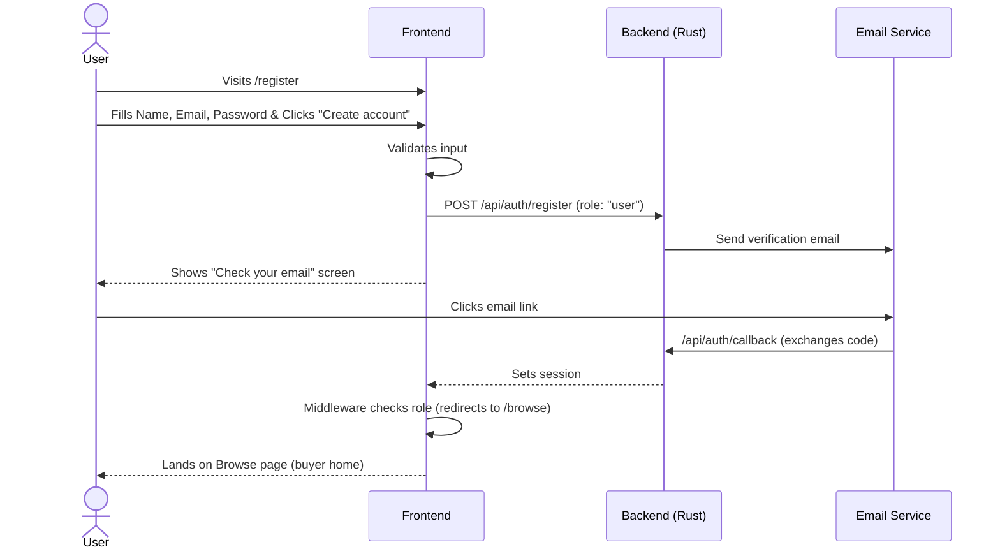

### 1.2 Login Flow

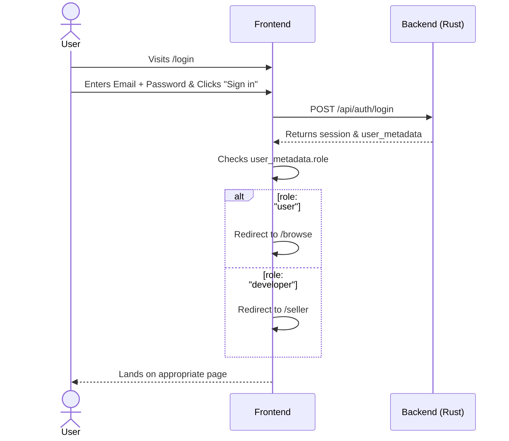

### 1.3 Browse & Search Flow

```mermaid
flowchart TD
    A([User lands on /browse]) --> B[Sees: Welcome banner, Categories, Product grid]
    B --> C{User Actions}
    C -->|Filter| D[Click category tabs]
    C -->|Search| E[Type in search bar]
    C -->|View| F[Click product card to view details]
    C -->|Paginate| G[Click "Load More"]
    D --> B
    E --> B
    G --> B
    F --> H([Lands on /products/id])
```

### 1.4 Purchase Flow (Razorpay)

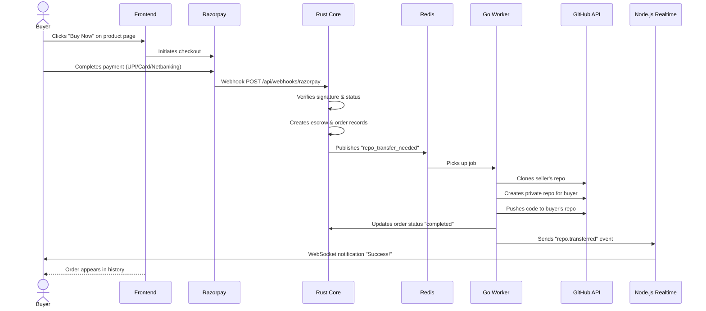

### 1.5 Order History Flow

```mermaid
flowchart TD
    A([User clicks "My Purchases"]) --> B[Lands on /dashboard]
    B --> C[Sees list of past orders]
    C --> D[Shows: Name, Date, Amount, GitHub Link]
    D --> E[User clicks GitHub link]
    E --> F([Opens repo in GitHub])
```

---

## 2. Seller Flows

### 2.1 Seller Registration Flow

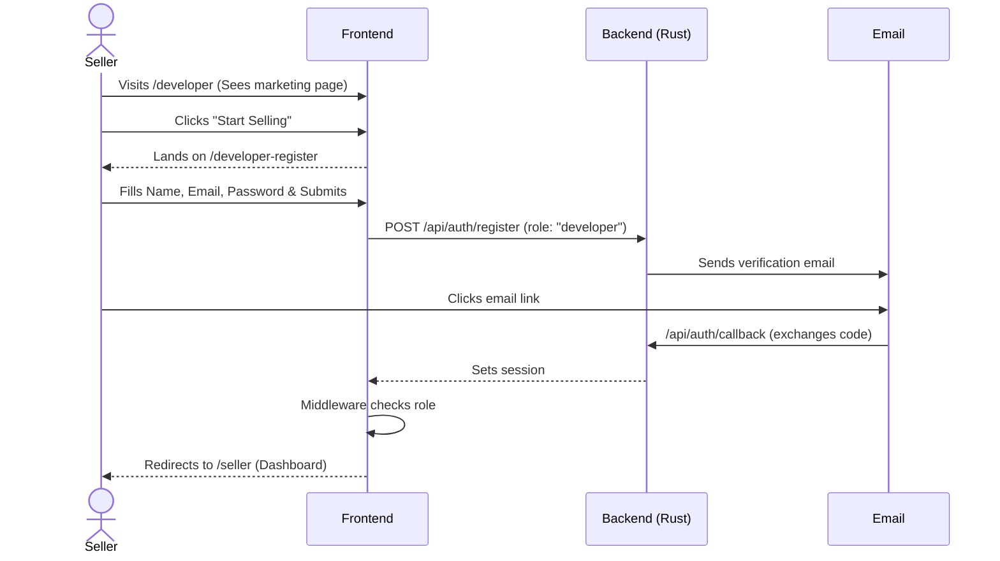

### 2.2 Product Listing Flow

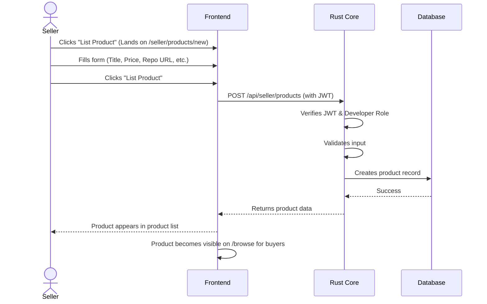

### 2.3 Product Management Flow

```mermaid
flowchart TD
    A([Seller clicks "Products"]) --> B[Lands on /seller/products]
    B --> C[Sees list of products with stats]
    C --> D{Actions}
    D -->|Edit| E[Update product details]
    D -->|Status| F[Toggle active/paused]
    D -->|Delete| G[Remove product]
    E --> H([Changes saved])
    F --> H
    G --> H
```

### 2.4 Earnings & Payout Flow

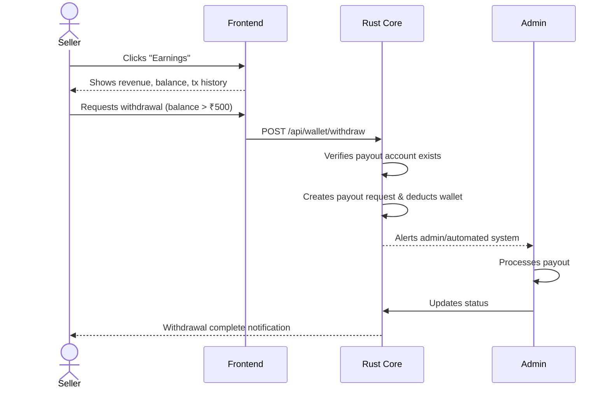

---

## 3. Admin Flows

### 3.1 Admin Login Flow

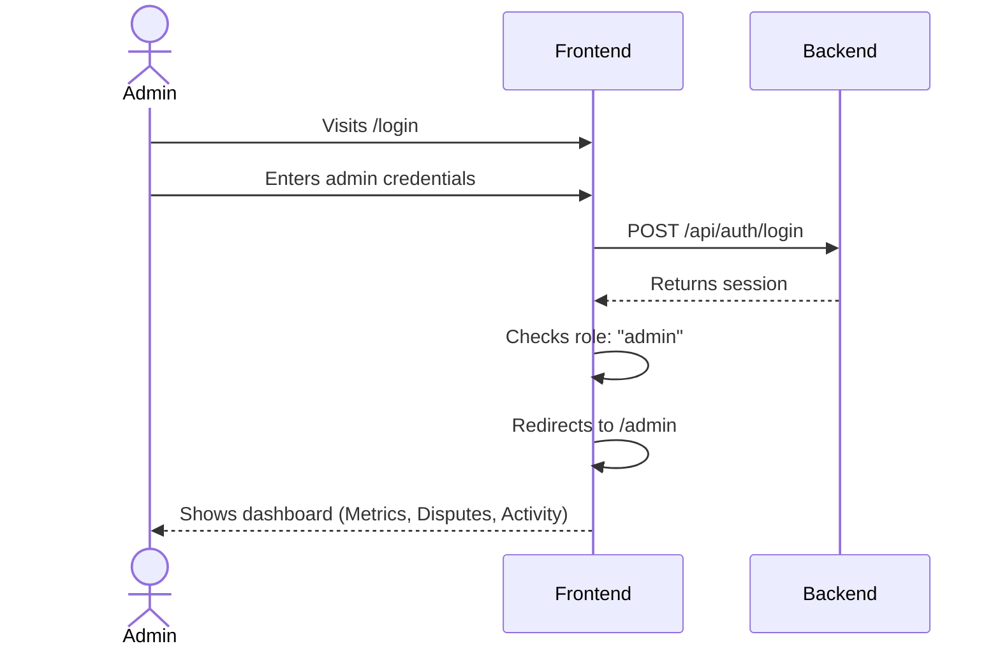

### 3.2 Product Moderation Flow

```mermaid
flowchart TD
    A([Admin clicks "Products"]) --> B[Sees list of all products with filters]
    B --> C{Actions}
    C -->|Approve| D[Mark draft as active]
    C -->|Pause| E[Suspend suspicious products]
    C -->|Delete| F[Remove violating products]
    D --> G([Database Updated])
    E --> G
    F --> G
```

### 3.3 Dispute Resolution Flow

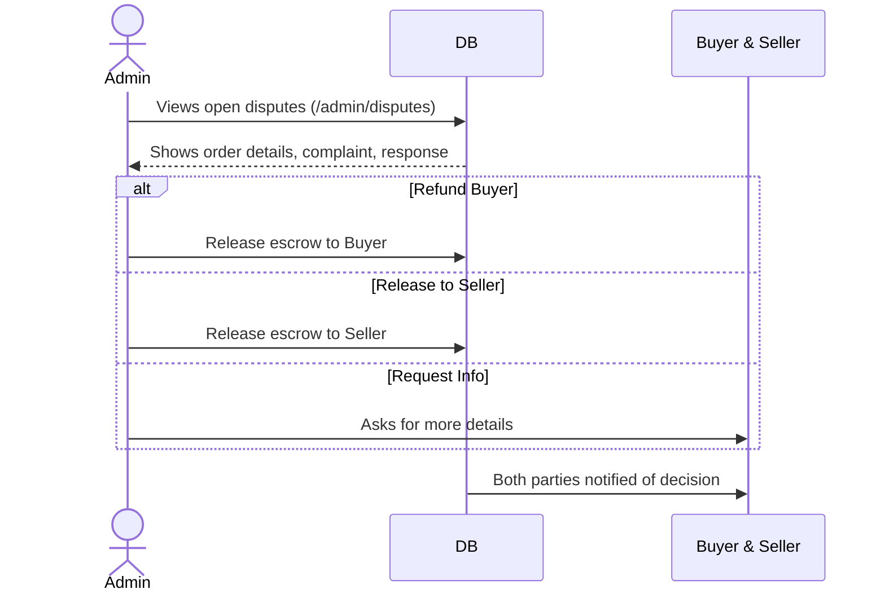

---

## 4. System Flows

### 4.1 Wallet Top-Up Flow (Razorpay)

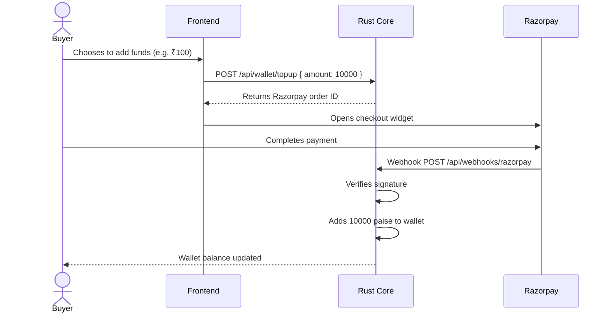

### 4.2 GitHub Repo Transfer Flow

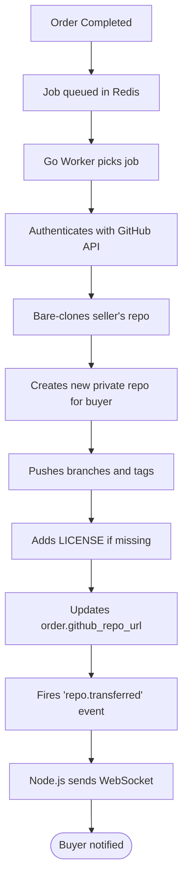

### 4.3 Escrow Flow

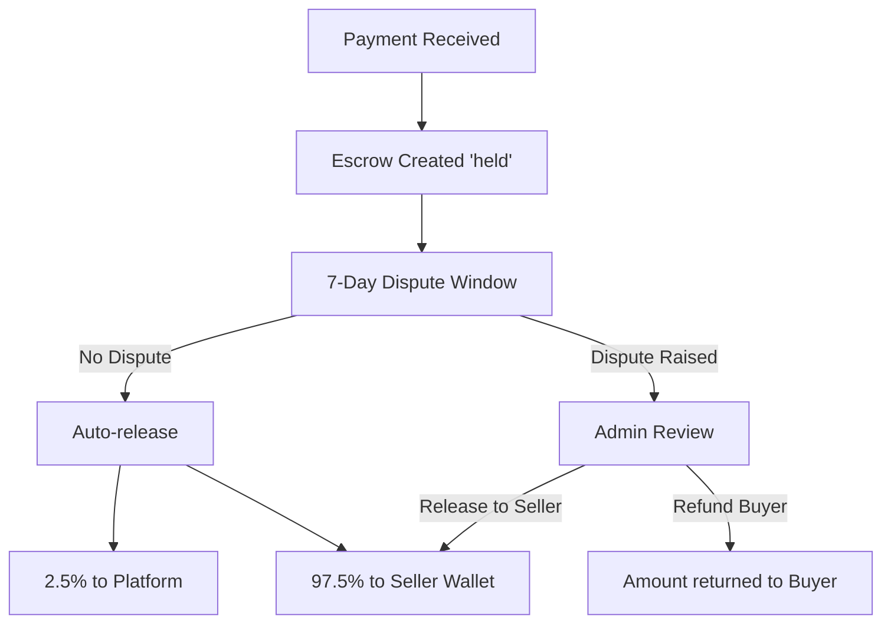

### 4.4 Notification Flow

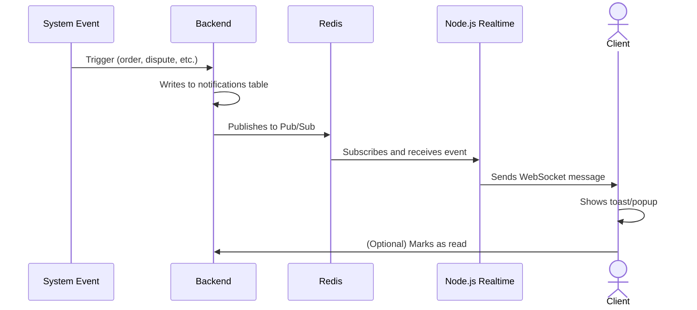

---

## 5. Company & Legal Page Flows

### Company Pages

| Route | Content | Purpose |
|-------|---------|---------|
| `/about` | Company story, mission, values | About KodeDock |
| `/blog` | Blog posts with categories | Content marketing |
| `/careers` | Job openings, company perks | Recruitment |
| `/contact` | Contact info + form | Customer support |
| `/press` | Brand assets, key facts | Media relations |

### Legal Pages

| Route | Content | Purpose |
|-------|---------|---------|
| `/privacy` | Privacy policy | Data protection compliance |
| `/terms` | Terms of service | Platform rules |
| `/refund` | Refund policy | Purchase protection |
| `/license` | License agreement | Code usage rights |
| `/cookies` | Cookie policy | Cookie compliance |

All Company and Legal pages use the shared `StaticPageLayout` component for consistent header/footer.

---

## 6. State Diagrams

### Order Status

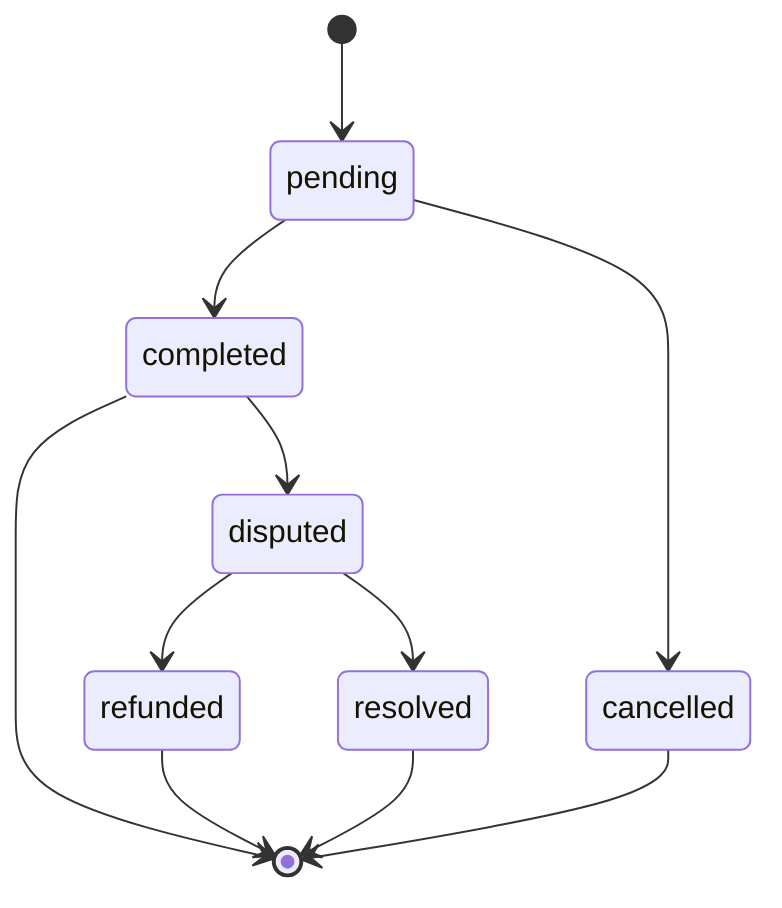

### Product Status

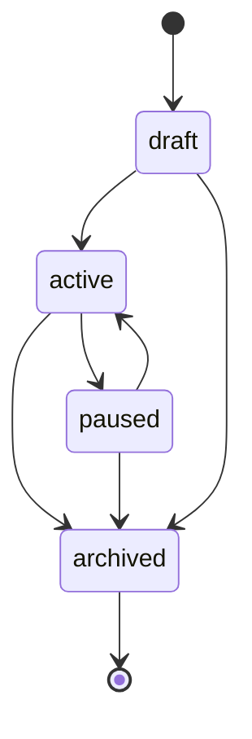

### Wallet Transaction Types

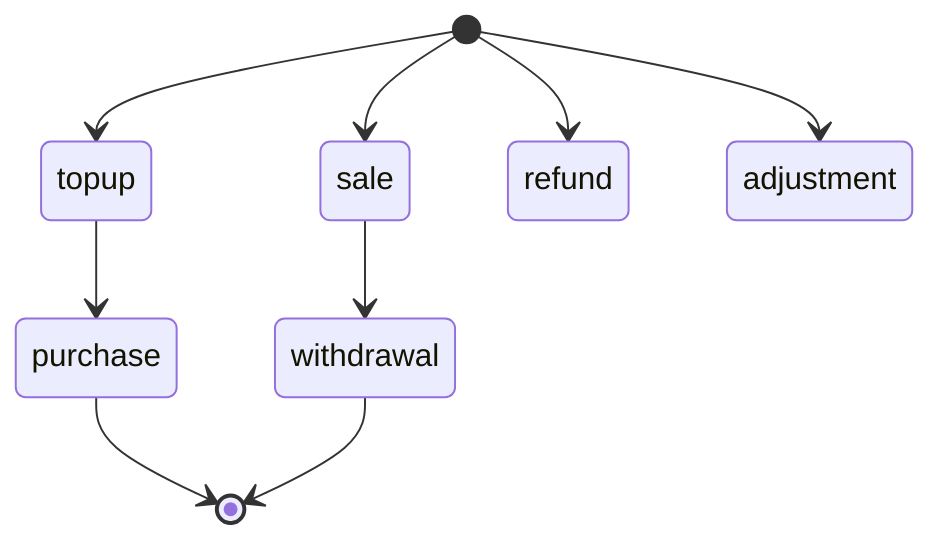

---

## 7. HQ (Owner) Flows

### 7.1 Dynamic Category Management

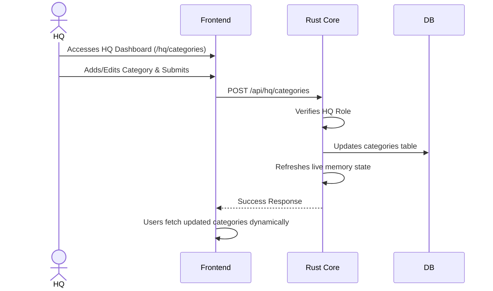

### 7.2 Live Integration Toggling

```mermaid
sequenceDiagram
    actor HQ
    participant Frontend
    participant Backend as Rust Core
    participant DB
    
    HQ->>Frontend: Navigates to Integrations (/hq/integrations)
    HQ->>Frontend: Toggles Integration (e.g., Razorpay)
    Frontend->>Backend: POST /api/hq/integrations/toggle
    Backend->>DB: Updates integration settings
    Backend->>Backend: Updates in-memory active integrations
    Backend-->>Frontend: Confirms toggle success
    Frontend->>Frontend: Clients fetch new state via /api/auth/config
```

---

*Document Version: v1.4.0 | Last Updated: August 2026*
