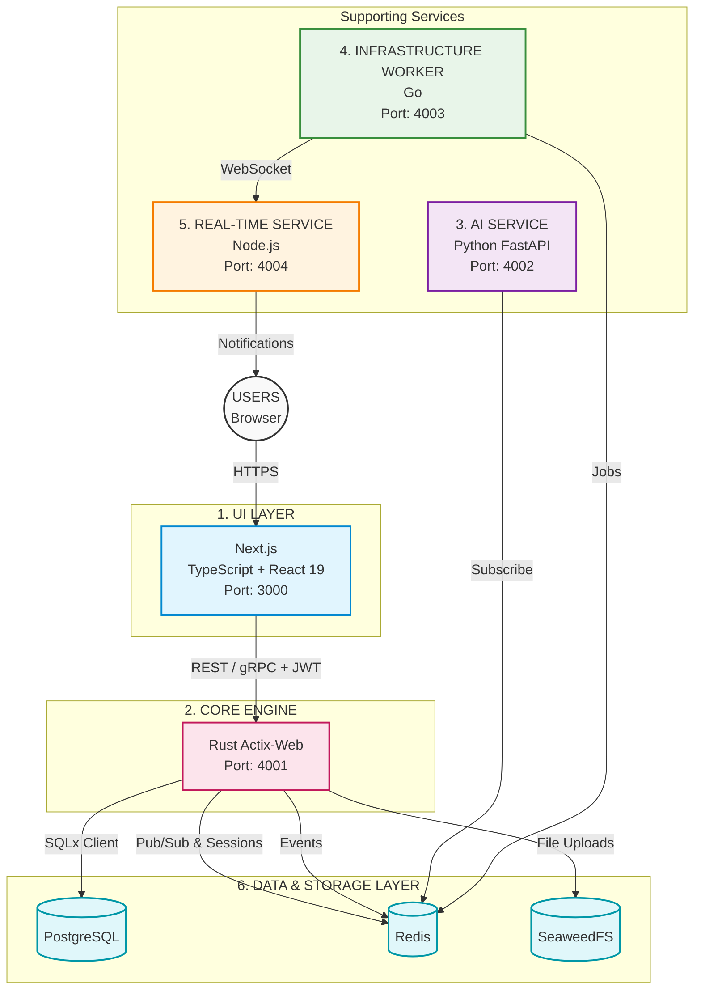
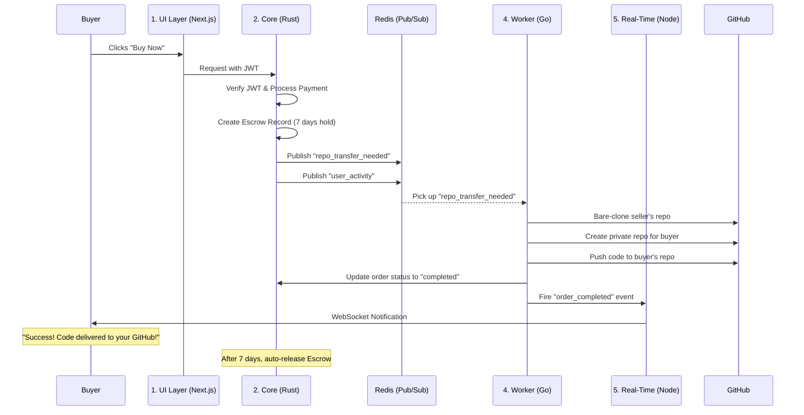
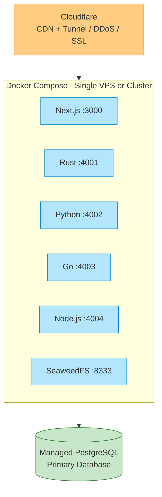

# KodeDock — System Architecture

> Polyglot Microservices — Each service has a specific role and doesn't interfere with others.

---

## Table of Contents
1. [Architecture Overview](#1-architecture-overview)
2. [Service Responsibilities](#2-service-responsibilities)
3. [Service Communication](#3-service-communication)
4. [Purchase Flow (End-to-End)](#4-purchase-flow-end-to-end)
5. [Deployment Architecture](#5-deployment-architecture)
6. [Network Isolation & Security](#6-network-isolation--security)
7. [Scalability Strategy](#7-scalability-strategy)
8. [Zero-Restart Dynamic Configuration](#8-zero-restart-dynamic-configuration)

---

## 1. Architecture Overview

---

## 2. Service Responsibilities

### Service 1: UI Layer (Next.js)
| Aspect | Detail |
|--------|--------|
| **Language** | TypeScript |
| **Framework** | Next.js 15 (App Router) + React 19 |
| **Port** | 3000 |
| **Role** | Render user interfaces, handle SSR/SEO |
| **Database Access** | None — calls backend services only |
| **Auth** | JWT-based (custom auth) |

### Service 2: Core Engine (Rust)
| Aspect | Detail |
|--------|--------|
| **Language** | Rust |
| **Framework** | Actix-Web |
| **Port** | 4001 |
| **Role** | Main gateway, security, transactions, Razorpay Integration |
| **Database Access** | PostgreSQL (service-role connection) |
| **Responsibilities** | JWT verification, wallet management, escrow, transactions |

### Service 3: AI Service (Python)
| Aspect | Detail |
|--------|--------|
| **Language** | Python |
| **Framework** | FastAPI |
| **Port** | 4002 |
| **Role** | Intelligence layer |
| **Database Access** | Read-only (SQLx client) |
| **Responsibilities** | Recommendations, AI search, fraud detection |

### Service 4: Infrastructure Worker (Go)
| Aspect | Detail |
|--------|--------|
| **Language** | Go |
| **Framework** | Standard library + goroutines |
| **Port** | 4003 |
| **Role** | Background automation |
| **Database Access** | PostgreSQL (service-role connection) |
| **Responsibilities** | Job processing, GitHub API, Docker management |

### Service 5: Real-Time Service (Node.js)
| Aspect | Detail |
|--------|--------|
| **Language** | TypeScript |
| **Framework** | ws / Socket.io |
| **Port** | 4004 |
| **Role** | Live updates |
| **Database Access** | Redis (pub/sub) |
| **Responsibilities** | WebSocket connections, notifications, streaming |

### Service 6: Data & Storage Layer
| Component | Purpose |
|-----------|---------|
| **PostgreSQL 16** | Primary database — users, products, orders, wallets, escrow |
| **Redis 7** | Job queues (BullMQ), caching, rate limiting, pub/sub |
| **SeaweedFS 3.76** | Fast, distributed object storage for images, product assets |

---

## 3. Service Communication

| From | To | Protocol | Purpose |
|------|----|----------|---------|
| Next.js | Rust Core | REST + JWT | All API calls |
| Rust Core | PostgreSQL | TCP | Database operations |
| Rust Core | Redis | TCP | Publish events, Cache |
| Rust Core | SeaweedFS | HTTP | Store/Retrieve Assets |
| Go Worker | Redis | TCP | Consume jobs |
| Go Worker | GitHub API | HTTPS | Repo operations |
| Go Worker | Docker | TCP | Container management |
| Python AI | Redis | TCP | Subscribe to events |
| Python AI | PostgreSQL | TCP | Read data |
| Go Worker | Node.js Realtime | WebSocket | Send notifications |
| Node.js Realtime | Browser | WebSocket | Push to client |

---

## 4. Purchase Flow (End-to-End)

---

## 5. Deployment Architecture

---

## 6. Network Isolation & Security

To ensure maximum security and prevent unauthorized cross-service communication, services are isolated using **Docker Bridge Networks**:
- **`public_net`**: Only Next.js is exposed to the outside world via reverse proxy (Cloudflare Tunnels or Nginx).
- **`internal_api_net`**: Next.js communicates with Rust Core over this internal network.
- **`data_net`**: Rust Core, Go Worker, and Python AI communicate with PostgreSQL, Redis, and SeaweedFS over a strictly internal database network. UI layers and external connections cannot reach this network directly.

---

## 7. Scalability Strategy

| Level | Strategy |
|-------|----------|
| **Horizontal** | Docker containers can be scaled per service |
| **Database** | PostgreSQL handles connection pooling + read replicas |
| **Caching** | Redis caches frequent queries (products, categories) |
| **Queue** | Redis + BullMQ handles job processing asynchronously |
| **Object Storage** | SeaweedFS distributes files across nodes highly efficiently |
| **CDN** | Cloudflare serves static assets globally |
| **Rate Limiting** | Redis-based rate limiting per user/IP |

---

## 8. Zero-Restart Dynamic Configuration

KodeDock utilizes a dynamic configuration architecture to apply settings, category changes, and integration toggles without restarting services:

- **Rust Core Engine (Live Memory):** The Rust backend keeps active configuration state in memory. When changes are saved, it updates the database and refreshes its in-memory state instantly.
- **Next.js Frontend (Dynamic Fetch):** Instead of relying on static build-time environment variables, the Next.js frontend fetches runtime configuration dynamically via the `/api/auth/config` endpoint. This propagates new features, integrations, and categories live to all connected clients.

---

*Document Version: 1.4.0 | Last Updated: August 2026*
