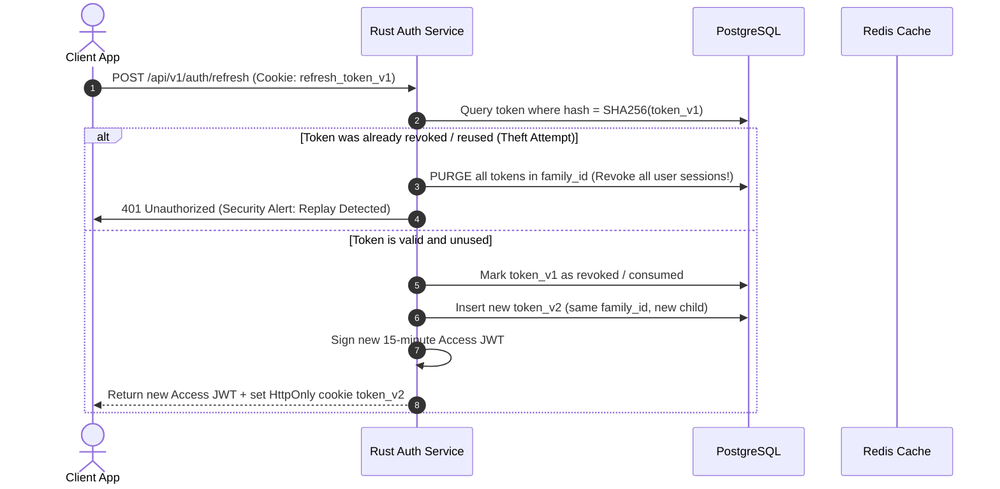
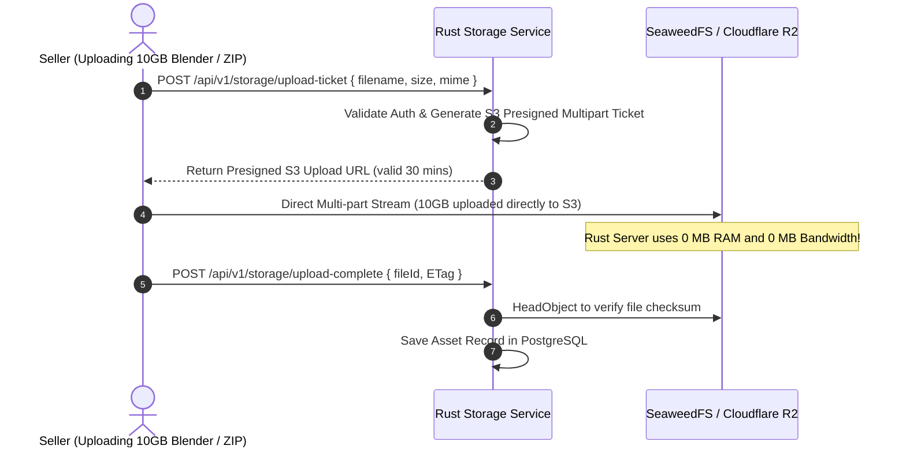
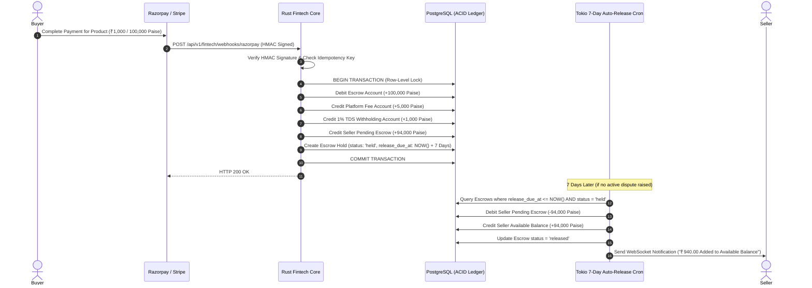
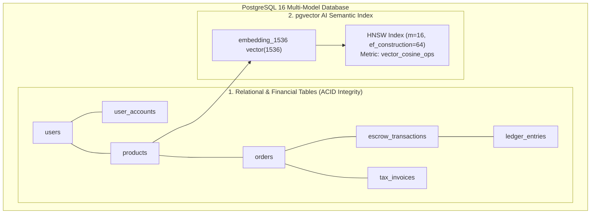
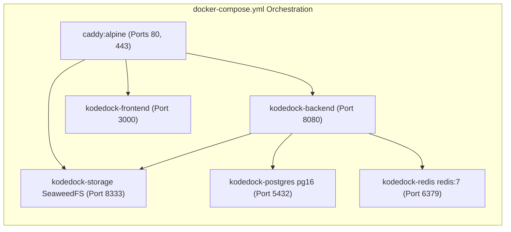

# 🏛️ KodeDock System Architecture & Design Document
**Document Version:** 1.0.0  
**Status:** Approved / Base Architecture Blueprint  
**Scale Target:** 5,000,000+ (5M+) Concurrent Users | Zero Server Crash  
**Author / Architect:** DeepMind Advanced Engineering Team & Lead Architect  

---

## 1. System Topology & Global Data Flow

KodeDock is architected as an **Ultra-High-Throughput, Modular Monolithic Core** written in **Rust**, flanked by a **Next.js 15 Web Frontend**, backed by **PostgreSQL 16 with `pgvector`**, **Redis 7**, and an **S3-Compatible Object Storage Engine (SeaweedFS / Cloudflare R2)**.

```mermaid
graph TD
    Client["🌐 Clients (Web Browser, Mobile, CLI)"]
    Caddy["🛡️ Caddy Reverse Proxy (Port 80 / 443)<br>• Automated TLS / SSL Let's Encrypt<br>• Rate Limiting & WebSocket Proxying"]

    subgraph Core_Rust_Engine ["🦀 KodeDock Core Backend Engine (Port 8080)"]
        Router["Actix-Web Async Router"]
        MW["Middleware (JWT Auth, Governor Rate Limiter, Tracing ID)"]

        subgraph Domains ["Domain Modules (Clean Isolated Architecture)"]
            Auth["🔐 auth/ (15m JWT, Token Family Rotation, TOTP 2FA)"]
            Market["🛒 marketplace/ (Listings, Versions, pgvector Search)"]
            Fintech["💳 fintech/ (7-Day Escrow, Double-Entry Ledger, Webhooks)"]
            Tax["⚖️ tax/ (1% TDS Sec 194-O, GST Engine, PDF Invoices)"]
            Storage["💾 storage/ (Direct Presigned S3 Streaming, Vault DRM)"]
            Security["🛡️ security/ (Tree-Sitter AST & Aho-Corasick Scanner)"]
            Realtime["⚡ realtime/ (Tokio WebSockets 500k+ connections)"]
            Jobs["⏰ jobs/ (Distributed Cron: Escrow Release, Cleanup)"]
        end
    end

    subgraph Data_Tier ["🐘 Data & Object Storage Tier"]
        Postgres["PostgreSQL 16 + pgvector<br>• ACID Ledger (Integer Paise)<br>• Cosine Vector HNSW Index"]
        Redis["Redis 7 Cluster<br>• Token Blacklist & Session Store<br>• WebSocket Pub/Sub Backplane"]
        S3FS["SeaweedFS S3 Storage (Port 8333)<br>• Mounted Oracle 200GB / 1TB Volume<br>• Public Media + Encrypted Private Vault"]
    end

    subgraph Web_Tier ["🌐 Web Frontend Tier (Port 3000)"]
        NextJS["Next.js 15 App Router (React 19)<br>• Edge SSR for 100/100 Google SEO<br>• In-Browser WebContainers Sandbox<br>• 360° Three.js 3D Model Viewer"]
    end

    Client <-->|HTTPS / WSS| Caddy
    Caddy <-->|/api/* & /ws/*| Router
    Caddy <-->|/* (Storefront)| NextJS
    Router --> MW
    MW --> Domains

    Domains <--> Postgres
    Domains <--> Redis
    Domains <--> S3FS
```

---

## 2. Clean Domain-Driven Modular Rust Architecture

To eliminate messy spaghetti code and ensure that **any new developer can immediately modify a feature without affecting other modules**, the codebase is partitioned into strictly isolated domain modules under `src/`:

```text
src/
├── main.rs                 # Server bootstrap & Actix App configuration (<50 lines)
├── config/                 # Environment variables, database pools, S3 credentials
├── middleware/             # Request ID, JWT extraction, rate-limiter, CORS
├── common/                 # Integer Paise math, standardized API responses, error types
├── auth/                   # [DOMAIN] Identity, JWT, Token Family Rotation, TOTP 2FA
│   ├── handlers.rs         # HTTP request controllers (signup, login, refresh, 2fa)
│   ├── models.rs           # User, Session, RefreshToken struct definitions
│   ├── service.rs          # Argon2id hashing, JWT signing, TOTP verification
│   └── repository.rs       # SQLx database query implementations
├── marketplace/            # [DOMAIN] Listings, versions, reviews, pgvector search
├── fintech/                # [DOMAIN] Double-entry ledger, 7-day escrow, Razorpay webhooks
├── tax/                    # [DOMAIN] 1% Section 194-O TDS deduction, GST calculations
├── storage/                # [DOMAIN] Presigned S3 tickets, 64KB streaming, temporary download tokens
├── security/               # [DOMAIN] Tree-Sitter AST secret scanner, code validator
├── realtime/               # [DOMAIN] Tokio WebSockets, notification channels, Redis pub/sub
└── jobs/                   # [DOMAIN] Tokio distributed cron scheduler (Escrow auto-release)
```

---

## 3. Core Operational Flows

### 3.1 Bank-Grade Token Family Rotation Flow

```mermaid
sequenceDiagram
    autonumber
    actor Client as Client App
    participant Auth as Rust Auth Service
    participant DB as PostgreSQL
    participant Redis as Redis Cache

    Client->>Auth: POST /api/v1/auth/refresh (Cookie: refresh_token_v1)
    Auth->>DB: Query token where hash = SHA256(token_v1)
    alt Token was already revoked / reused (Theft Attempt)
        Auth->>DB: PURGE all tokens in family_id (Revoke all user sessions!)
        Auth->>Client: 401 Unauthorized (Security Alert: Replay Detected)
    else Token is valid and unused
        Auth->>DB: Mark token_v1 as revoked / consumed
        Auth->>DB: Insert new token_v2 (same family_id, new child)
        Auth->>Auth: Sign new 15-minute Access JWT
        Auth-->>Client: Return new Access JWT + set HttpOnly cookie token_v2
    end
```

---

### 3.2 Zero-Server-Load S3 Direct Upload Flow

```mermaid
sequenceDiagram
    autonumber
    actor Creator as Seller (Uploading 10GB Blender / ZIP)
    participant Rust as Rust Storage Service
    participant S3 as SeaweedFS / Cloudflare R2

    Creator->>Rust: POST /api/v1/storage/upload-ticket { filename, size, mime }
    Rust->>Rust: Validate Auth & Generate S3 Presigned Multipart Ticket
    Rust-->>Creator: Return Presigned S3 Upload URL (valid 30 mins)
    Creator->>S3: Direct Multi-part Stream (10GB uploaded directly to S3)
    Note over S3: Rust Server uses 0 MB RAM and 0 MB Bandwidth!
    Creator->>Rust: POST /api/v1/storage/upload-complete { fileId, ETag }
    Rust->>S3: HeadObject to verify file checksum
    Rust->>Rust: Save Asset Record in PostgreSQL
```

---

### 3.3 7-Day Escrow & Double-Entry Ledger Flow

```mermaid
sequenceDiagram
    autonumber
    actor Buyer as Buyer
    participant Webhook as Razorpay / Stripe
    participant Rust as Rust Fintech Core
    participant DB as PostgreSQL (ACID Ledger)
    participant Cron as Tokio 7-Day Auto-Release Cron
    actor Seller as Seller

    Buyer->>Webhook: Complete Payment for Product (₹1,000 / 100,000 Paise)
    Webhook->>Rust: POST /api/v1/fintech/webhooks/razorpay (HMAC Signed)
    Rust->>Rust: Verify HMAC Signature & Check Idempotency Key
    Rust->>DB: BEGIN TRANSACTION (Row-Level Lock)
    Rust->>DB: Debit Escrow Account (+100,000 Paise)
    Rust->>DB: Credit Platform Fee Account (+5,000 Paise)
    Rust->>DB: Credit 1% TDS Withholding Account (+1,000 Paise)
    Rust->>DB: Credit Seller Pending Escrow (+94,000 Paise)
    Rust->>DB: Create Escrow Hold (status: 'held', release_due_at: NOW() + 7 Days)
    Rust->>DB: COMMIT TRANSACTION
    Rust-->>Webhook: HTTP 200 OK

    Note over Cron: 7 Days Later (if no active dispute raised)
    Cron->>DB: Query Escrows where release_due_at <= NOW() AND status = 'held'
    Cron->>DB: Debit Seller Pending Escrow (-94,000 Paise)
    Cron->>DB: Credit Seller Available Balance (+94,000 Paise)
    Cron->>DB: Update Escrow status = 'released'
    Cron->>Seller: Send WebSocket Notification ("₹940.00 Added to Available Balance")
```

---

## 4. Database Architecture & Vector Search Strategy


```mermaid
graph TD
    subgraph PostgreSQL_16 ["PostgreSQL 16 Multi-Model Database"]
        subgraph Relational_Core ["1. Relational & Financial Tables (ACID Integrity)"]
            U[users] --- A[user_accounts]
            U --- P[products]
            P --- O[orders]
            O --- E[escrow_transactions]
            E --- L[ledger_entries]
            O --- T[tax_invoices]
        end

        subgraph Vector_AI ["2. pgvector AI Semantic Index"]
            P --> V["embedding_1536 vector(1536)"]
            V --> HNSW["HNSW Index (m=16, ef_construction=64)<br>Metric: vector_cosine_ops"]
        end
    end
```

### 4.1 `pgvector` HNSW Indexing for Sub-3ms Search
Products are indexed with 1536-dimensional embeddings:
```sql
CREATE INDEX idx_products_embedding_hnsw 
ON products 
USING hnsw (embedding_1536 vector_cosine_ops)
WITH (m = 16, ef_construction = 64);
```
Query execution runs directly inside PostgreSQL:
```sql
SELECT id, title, slug, base_price_paise,
       1 - (embedding_1536 <=> $1) AS similarity
FROM products
WHERE is_published = TRUE
ORDER BY embedding_1536 <=> $1
LIMIT 20;
```

---

## 5. Deployment & Container Orchestration

KodeDock runs inside a unified Docker network with strict restart policies and health-checking dependencies:


```mermaid
graph LR
    subgraph Docker_Compose_Stack ["docker-compose.yml Orchestration"]
        Caddy["caddy:alpine (Ports 80, 443)"]
        Backend["kodedock-backend (Port 8080)"]
        Frontend["kodedock-frontend (Port 3000)"]
        Storage["kodedock-storage SeaweedFS (Port 8333)"]
        Postgres["kodedock-postgres pg16 (Port 5432)"]
        Redis["kodedock-redis redis:7 (Port 6379)"]
    end

    Caddy --> Backend
    Caddy --> Frontend
    Caddy --> Storage

    Backend --> Postgres
    Backend --> Redis
    Backend --> Storage
```

### Auto-Bootstrapping Principle:
- When the stack starts up (`docker compose up --build -d`), PostgreSQL initializes and executes all migrations in `docker/migrations/` sequentially.
- The Rust backend connects via connection pool healthchecks and begins accepting HTTP/WebSocket connections.
- Caddy automatically provisions SSL certificates via Let's Encrypt for public traffic.
