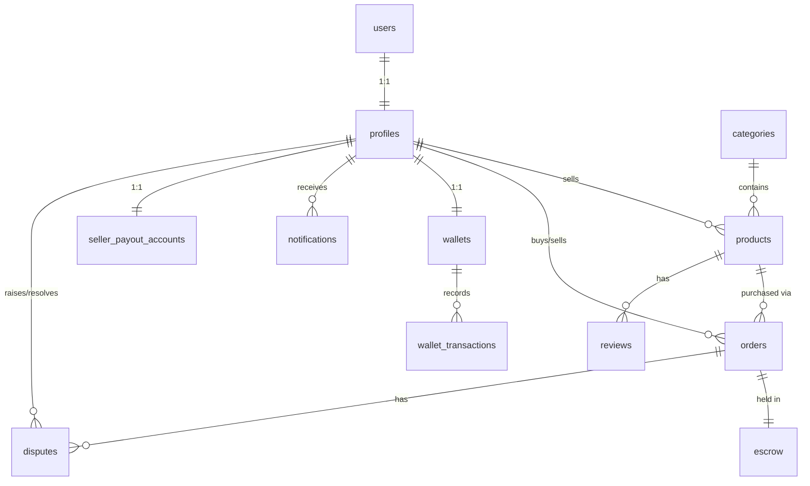
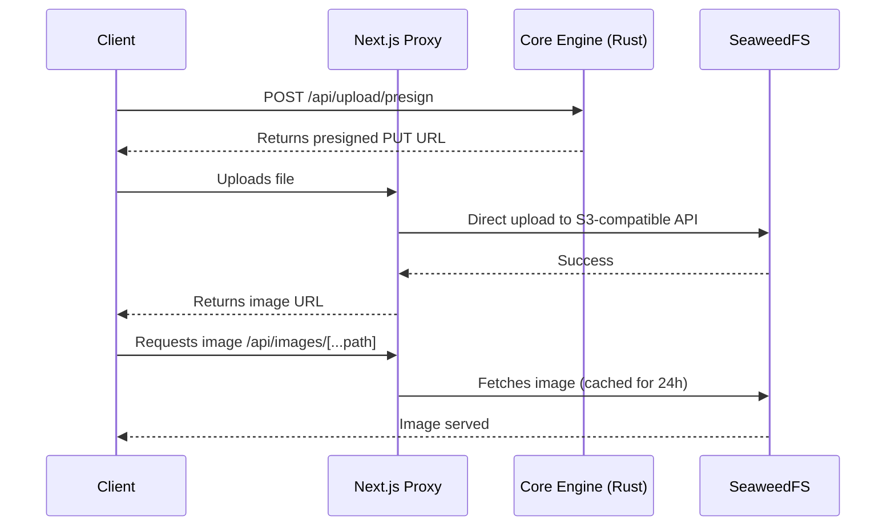

# KodeDock — Backend Work & Schema

> Detailed backend implementation plan — what each service does, complete database schema, and API specifications.

---

## Table of Contents
1. [Service Architecture Summary](#1-service-architecture-summary)
2. [Database Schema (Complete SQL)](#2-database-schema-complete-sql)
3. [Row-Level Security Policies](#3-row-level-security-policies)
4. [Redis Job Queues](#4-redis-job-queues)
5. [API Route Map](#5-api-route-map)
6. [Caching Strategy](#6-caching-strategy)
7. [Rate Limiting](#7-rate-limiting)
8. [Storage (SeaweedFS)](#8-storage-seaweedfs)

---

## 1. Service Architecture Summary

```mermaid
flowchart LR
    Client([Client App]) --> Gateway
    
    subgraph Backend Architecture
        Gateway -->|Port 4001| Core[Core Engine (Rust)]
        Gateway -->|Port 4002| AI[AI Service (Python)]
        Gateway -->|Port 4003| Infra[Infra Worker (Go)]
        Gateway -->|Port 4004| RealTime[Real-Time (Node.js)]
        
        Core <--> DB[(PostgreSQL :5432)]
        Core <--> Redis[(Redis :6379)]
        Infra <--> Redis
        RealTime <--> Redis
        AI <--> DB
    end
```

| Service | Language | Port | Role |
|---------|----------|------|------|
| **Core Engine** | Rust | 4001 | Security, transactions, wallet |
| **AI Service** | Python | 4002 | Recommendations, search, fraud |
| **Infrastructure Worker** | Go | 4003 | GitHub API, Docker, background jobs |
| **Real-Time Service** | Node.js | 4004 | WebSocket notifications |
| **Database** | PostgreSQL | 5432 | Primary database |
| **Cache/Queue** | Redis | 6379 | Jobs, cache, pub/sub |

---

## 2. Database Schema (Complete SQL)

### Entity Relationship Diagram



*Note: The complete SQL table definitions, indexing strategies, and database triggers (including user auto-creation) are maintained in the primary database migration scripts. The diagram above represents the core logical architecture and entity relationships.*

---

## 3. Row-Level Security Policies

```sql
-- Note: RLS is optional when using a service-role connection from the backend.
-- Enable if exposing the database directly to clients.
-- ALTER TABLE profiles ENABLE ROW LEVEL SECURITY;
-- CREATE POLICY "Public profiles" ON profiles FOR SELECT USING (true);
-- CREATE POLICY "Update own profile" ON profiles FOR UPDATE USING (id = current_setting('app.current_user_id')::uuid);
```

---

## 4. Redis Job Queues

```mermaid
flowchart TD
    Rust[Core Engine (Rust)] -->|Publishes Job| Redis[(Redis Queue)]
    Cron[Cron Job] -->|Publishes Job| Redis
    Redis -->|Consumes Job| Go[Infra Worker (Go)]
    Redis -->|Consumes Job| Node[Real-Time (Node.js)]
    Redis -->|Consumes Job| Python[AI Service (Python)]
```

### Queue Names

| Queue | Producer | Consumer | Purpose |
|-------|----------|----------|---------|
| `repo_transfer` | Core Engine (Rust) | Infra Worker (Go) | GitHub repo creation |
| `preview_build` | Core Engine (Rust) | Infra Worker (Go) | Docker container start |
| `preview_cleanup` | Cron job | Infra Worker (Go) | Docker container cleanup |
| `notification` | Core Engine (Rust) | Real-Time (Node.js) | Push notifications |
| `analytics` | Core Engine (Rust) | AI Service (Python) | User behavior tracking |

### Job Schema Structure

| Field | Type | Description |
|-------|------|-------------|
| `id` | `UUID` | Unique identifier for the job |
| `type` | `String` | Type of job (e.g., `repo_transfer`) |
| `payload` | `Object` | Job-specific data payload |
| `priority` | `String` | Queue priority level (`high`, `normal`, `low`) |
| `attempts` | `Integer` | Current retry attempt count |
| `maxAttempts` | `Integer` | Maximum allowed retry attempts |
| `createdAt` | `Timestamp` | Job creation timestamp |

---

## 5. API Route Map

### Core Engine (Rust) — Port 4001

#### Health & System
- `GET /health` - Health check

#### Auth (rate-limited: 5 req / 12s)
- `POST /api/auth/register`
- `POST /api/auth/login`
- `POST /api/auth/forgot-password`
- `POST /api/auth/reset-password`
- `POST /api/auth/logout`
- `GET /api/auth/me`
- `POST /api/auth/change-password`
- `DELETE /api/auth/delete-account`

#### Profile
- `GET /api/profile/:id`
- `PUT /api/profile`

#### Products (public)
- `GET /api/products` *(Returns list of active products)*
- `GET /api/products/:id` *(Returns detailed product information)*

#### Seller (developer-only)
- `GET /api/seller/products`
- `POST /api/seller/products` *(Requires Product Creation Payload)*
- `PUT /api/seller/products/:id`
- `DELETE /api/seller/products/:id`
- `GET /api/seller/stats`
- `GET /api/seller/payout-account`
- `POST /api/seller/payout-account`
- `DELETE /api/seller/payout-account`

#### Wallet (auth required)
- `GET /api/wallet`
- `POST /api/wallet/topup`
- `POST /api/wallet/topup/verify`
- `GET /api/wallet/transactions`
- `POST /api/wallet/withdraw`
- `POST /api/wallet/release-escrow`

#### Orders (auth required)
- `POST /api/orders` *(Requires Product ID; Returns Order Status)*
- `POST /api/orders/verify`
- `GET /api/orders`
- `GET /api/orders/:id`
- `POST /api/webhooks/razorpay`

#### Reviews
- `GET /api/reviews/:productId`
- `POST /api/reviews`

#### Notifications
- `GET /api/notifications`
- `PUT /api/notifications/:id/read`

#### HQ Owner Dashboard (admin-only)
- `GET /api/hq/integrations` *(Manage third-party connections)*
- `PUT /api/hq/integrations`
- `GET /api/hq/catalog` *(Global catalog management)*
- `GET /api/hq/finance/ledger` *(Financial overview and platform fee tracking)*
- `POST /api/hq/config/sync` *(Trigger Zero-Restart Dynamic Environment Sync)*

#### Upload (rate-limited: 10 req / 6s)
- `POST /api/upload/presign`

### AI Service (Python) — Port 4002

- `GET /api/recommendations/:userId`
- `POST /api/search`
- `POST /api/fraud/check`
- `GET /api/analytics/dashboard`

### Infrastructure Worker (Go) — Port 4003

- `GET /api/health`
- `GET /api/jobs/status`
- `POST /api/preview/build`
- `POST /api/preview/stop`
- `GET /api/preview/:id/logs`

### Real-Time Service (Node.js) — Port 4004

- `GET /ws`
- `GET /health`

---

## 6. Caching Strategy

| Data | Cache Duration | Invalidation |
|------|---------------|--------------|
| Product list | 5 minutes | On product update |
| Product detail | 10 minutes | On product update |
| Categories | 1 hour | On category update |
| User profile | 5 minutes | On profile update |
| Search results | 2 minutes | On product change |

---

## 7. Rate Limiting

Implemented via `actix-governor` with custom `ForwardedIpKeyExtractor` that reads `X-Forwarded-For` (set by Next.js proxy) to rate-limit per real client IP.

| Endpoint Group | Limit | Window |
|----------------|-------|--------|
| `/api/auth/register, login, forgot/reset-password` | 5 requests | 12 seconds |
| `/api/upload/presign` | 10 requests | 6 seconds |
| `/api/orders/verify` | 10 requests | 6 seconds |

---

## 8. Storage (SeaweedFS)

Self-hosted S3-compatible object storage for product images and avatars.



| Config | Value |
|--------|-------|
| Docker image | `chrislusf/seaweedfs:3.76` |
| S3 API | Port 8333 |
| Filer API | Port 8888 |
| Bucket | `kodedock-media` |
| Allowed paths | `products/`, `avatars/` |
| Allowed types | JPEG, PNG, GIF, WebP |

**Upload flow:** Client requests presigned PUT URL → uploads directly to SeaweedFS via Next.js proxy → image served through `/api/images/[...path]` proxy with 24h cache headers.

---

*Document Version: v1.7.0 | Last Updated: August 2026*
