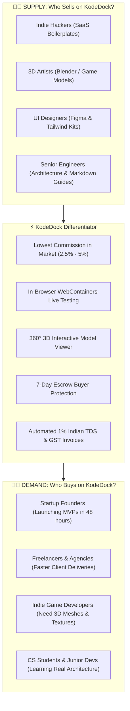
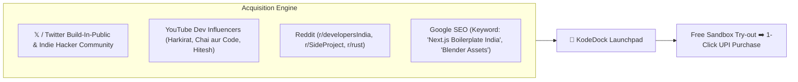

# 🎯 KodeDock Target Audience, User Personas & Go-To-Market Strategy
**Document Version:** 1.0.0  
**Status:** Approved Marketing & Growth Strategy  
**Focus Market:** India-First ➡️ Global Developer Ecosystem  
**Author / Architect:** DeepMind Advanced Engineering Team & Growth Lead  

---

## 1. Market Opportunity & Value Proposition

KodeDock bridges the gap between **Creators who build high-value digital assets** and **Developers/Founders who need speed and reliable code**.

---

## 2. Deep Dive: Supply-Side Personas (Sellers / Creators)

### Persona 1: The Indie Hacker & Boilerplate Creator
* **Profile:** Full-stack engineer building micro-SaaS templates, starter kits, and authentication wrappers.
* **Pain Point:** Traditional platforms (Envato, CodeCanyon) charge **35% to 50% commission**, taking half their earnings.
* **Why They Choose KodeDock:**
  - **Ultra-Low Commission (2.5% – 5.0%):** They keep **95%+** of their listing price.
  - **Zero Tax Hassle:** 1% Section 194-O TDS is deducted automatically and credited to their PAN card.
  - **Real Example:**
    > *"Rohan (Bengaluru): Built a Next.js 15 + Supabase multi-tenant SaaS starter. He lists it on KodeDock for ₹2,499. On Envato, he would take home only ₹1,350. On KodeDock, he takes home **₹2,386** directly in his bank account via IMPS/UPI."*

---

### Persona 2: The 3D Artist & Game Environment Creator
* **Profile:** 3D modeler creating Blender `.blend`, FBX, OBJ, and Unreal/Unity low-poly/high-poly asset packs.
* **Pain Point:** ArtStation and TurboSquid charge high fees and lack developer-friendly purchase workflows.
* **Why They Choose KodeDock:**
  - **Direct S3 Uploads (up to 50 GB):** Zero file size bottlenecks.
  - **In-Browser 360° 3D Mesh Inspection:** Buyers can rotate, zoom, and inspect wireframes before buying, reducing refunds and disputes.
  - **Real Example:**
    > *"Anjali (Pune): Creates low-poly game-ready cyberpunk vehicle packs (Blender + FBX). She lists her 2GB bundle on KodeDock for ₹999. Buyers inspect the 3D model in their browser in 360 degrees and buy with 1-click UPI."*

---

### Persona 3: The UI/UX Designer & Design System Architect
* **Profile:** Figma creator, Tailwind UI designer, iconographer.
* **Pain Point:** Gumroad has high cross-border payment decline rates for Indian buyers with 10% fees.
* **Why They Choose KodeDock:**
  - Native INR UPI payment support (99%+ payment success rate in India).
  - Instant automated delivery of Figma tokens, Sketch files, and CSS components.
  - **Real Example:**
    > *"Vikram (Mumbai): Sells an iOS 18 Design Kit with 400+ Figma components and Tailwind classes for ₹1,499. Indian agency developers buy it effortlessly via Google Pay / PhonePe."*

---

### Persona 4: Technical Author & E-Book / Cheatsheet Creator
* **Profile:** Senior engineer or architect publishing deep-dive markdown guides, system design blueprints, and interview kits.
* **Why They Choose KodeDock:**
  - Beautiful syntax-highlighted markdown preview with instant PDF download.
  - **Real Example:**
    > *"Sameer (Senior Backend Lead): Publishes a 120-page 'High-Scale Rust Microservices Guide' in Markdown + Code repository for ₹499."*

---

## 3. Deep Dive: Demand-Side Personas (Buyers & Developers)

### Persona 1: The Startup Founder & Solopreneur
* **Profile:** Non-technical founder or solo hacker building a startup on a shoestring budget.
* **Need:** Wants to launch an MVP in 2–3 days without spending ₹3 Lakhs on an agency.
* **Why They Buy on KodeDock:**
  - **In-Browser Sandbox:** They test-run the code in their browser before buying.
  - **7-Day Escrow:** Zero risk of getting scammed by broken or abandoned code.
  - **Real Example:**
    > *"Karan (Founder, Delhi): Wants to launch an AI resume builder. Instead of hiring a developer for 2 months, he buys a ready-made Next.js AI boilerplate on KodeDock for ₹1,999, customizes the prompt, connects his Gemini API key, and launches in 48 hours."*

---

### Persona 2: The Freelancer & Software Agency
* **Profile:** Web agency or freelance developer handling 5 to 10 client projects simultaneously.
* **Need:** High-quality modular components (Admin panels, Billing portals, Booking engines) to deliver client projects in 1 week.
* **Why They Buy on KodeDock:**
  - Clean, modern codebases (Next.js 15, Tailwind, Rust) that are easy to customize.
  - Commercial license included with Ed25519 activation keys.
  - **Real Example:**
    > *"PixelStudio Agency (Hyderabad): Wins a ₹1,50,000 gym management web app contract. They purchase a verified Admin Dashboard boilerplate on KodeDock for ₹1,299, deliver the project in 4 days, and make a 98% profit margin."*

---

### Persona 3: The Indie Game Developer
* **Profile:** Solo programmer building indie games in Unity or Godot.
* **Need:** Needs 3D characters, props, environments, and sound effects because they cannot do 3D modeling themselves.
* **Why They Buy on KodeDock:**
  - In-browser 3D preview ensures assets have clean topology and textures before purchasing.
  - **Real Example:**
    > *"Dev (Indie Game Dev, Indore): Building a mobile dungeon crawler on Godot. He buys a 3D Fantasy Weapon Pack on KodeDock for ₹699 to complete his game."*

---

### Persona 4: The Computer Science Student & Junior Developer
* **Profile:** Engineering students and self-taught developers preparing for jobs or capstone projects.
* **Need:** Wants to study real-world production-grade architectures (not toy tutorials).
* **Why They Buy on KodeDock:**
  - High-quality, real-world codebases with unit tests, Docker setups, and clean documentation for affordable prices (₹299 – ₹799).
  - **Real Example:**
    > *"Aryan (B.Tech Student, Bengaluru): Buys a Flutter + Supabase E-commerce app on KodeDock for ₹499 to learn clean architecture and showcase it on his GitHub portfolio."*

---

## 4. Go-To-Market (GTM) Strategy for India Launch

### 1. **The Creator Referral Loop (Viral Growth):**
* Because KodeDock charges **only 2.5% – 5.0% commission** (vs 35% on other platforms), creators will actively share their KodeDock product links on their Twitter/X, LinkedIn, and YouTube channels.
* *"Buy my SaaS starter on KodeDock (UPI accepted)"* ➡️ Every creator brings hundreds of new buyers to KodeDock for free!

### 2. **Build In Public on X (Twitter) & LinkedIn:**
* Share behind-the-scenes engineering wins:
  - *"How we run in-browser WebContainers sandboxes for ₹0 server cost."*
  - *"Why we built our financial ledger in Rust integer paise."*
  - *"Why Indian creators keep 96.5% of their revenue on KodeDock."*

### 3. **Developer Communities:**
* Launch on `r/developersIndia`, `r/SideProject`, Indie Hackers, and Product Hunt with exclusive launch discounts.
