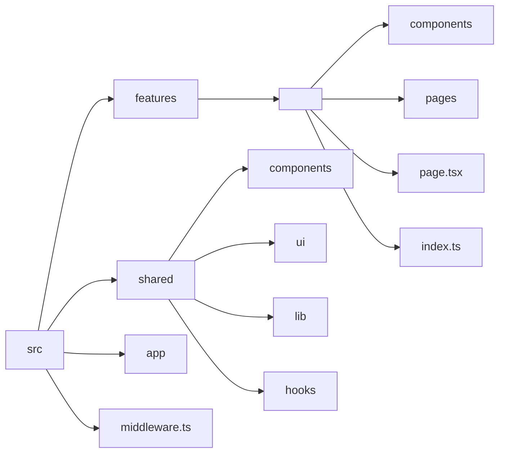
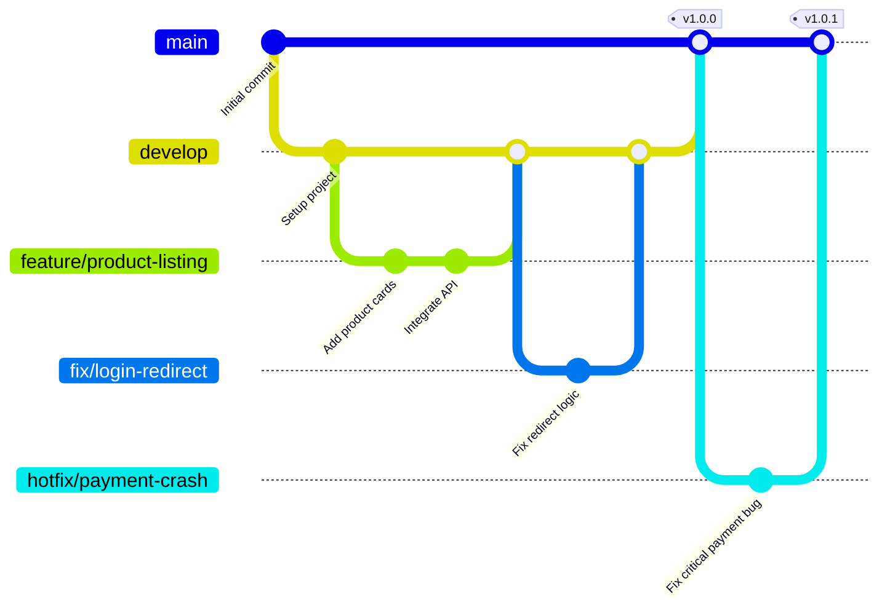

# KodeDock — Rules & Conventions

> Consistency is key. Every developer should follow these rules to keep the codebase professional.

---

## Table of Contents
1. [Folder Structure Rules](#1-folder-structure-rules)
2. [Naming Conventions](#2-naming-conventions)
3. [Code Style Rules](#3-code-style-rules)
4. [Git Rules](#4-git-rules)
5. [API Design Rules](#5-api-design-rules)
6. [Database Rules](#6-database-rules)
7. [Security Rules](#7-security-rules)
8. [Performance Rules](#8-performance-rules)
9. [Testing Rules](#9-testing-rules)
10. [Documentation Rules](#10-documentation-rules)
11. [Environment Variables](#11-environment-variables)

---

## 1. Folder Structure Rules

### Frontend (Next.js)



**Rule:** Never put feature-specific code in `shared/`. Never put shared code in `features/`.

### Backend (Per Service)

```
src/
├── handlers/          # Request handlers / controllers
├── models/            # Data models / schemas
├── services/          # Business logic
├── middleware/         # Auth, validation, rate limiting
├── utils/             # Helper functions
└── main.rs/go/app.py  # Entry point
```

---

## 2. Naming Conventions

### Files

| Type | Convention | Example |
|------|-----------|---------|
| React Components | `kebab-case.tsx` | `product-card.tsx` |
| Utilities | `kebab-case.ts` | `use-mobile.ts` |
| Page files | `page.tsx` | `app/browse/page.tsx` |
| Layout files | `layout.tsx` | `app/seller/layout.tsx` |
| API routes | `route.ts` | `app/api/auth/callback/route.ts` |
| Index files | `index.ts` | `features/browse/index.ts` |

### Components

| Type | Convention | Example |
|------|-----------|---------|
| Component files | `kebab-case` | `product-card.tsx` |
| Component names | `PascalCase` | `ProductCard` |
| Props interfaces | `PascalCase + Props` | `ProductCardProps` |
| Default exports | Named function | `export function ProductCard()` |

### Variables & Functions

| Type | Convention | Example |
|------|-----------|---------|
| Variables | `camelCase` | `userName`, `isSelected` |
| Functions | `camelCase` | `getUserRole()`, `formatPrice()` |
| Constants | `UPPER_SNAKE_CASE` | `ROLES`, `API_URL` |
| Types/Interfaces | `PascalCase` | `UserRole`, `ProductCardProps` |

### Routes

| Type | Convention | Example |
|------|-----------|---------|
| Pages | `kebab-case` | `/seller/products/new` |
| API routes | `kebab-case` | `/api/auth/callback` |
| Dynamic routes | `[param]` | `/products/[id]` |

---

## 3. Code Style Rules

### TypeScript

```typescript
// ✅ DO: Use explicit types for function parameters
function formatPrice(price: number): string {
  return `₹${price}`;
}

// ✅ DO: Use interface for props
interface ProductCardProps {
  title: string;
  price: number;
}

// ❌ DON'T: Use `any`
const data: any = {};

// ❌ DON'T: Use `var`
var x = 1;
```

### React

```typescript
// ✅ DO: Use functional components
export function ProductCard({ title }: ProductCardProps) {
  return <div>{title}</div>;
}

// ✅ DO: Use proper imports
import { Button } from "@/shared/ui/button";

// ❌ DON'T: Use class components
class ProductCard extends React.Component {}
```

### CSS/Tailwind

```tsx
// ✅ DO: Use Tailwind classes
<div className="flex items-center gap-4">

// ✅ DO: Use cn() for conditional classes
className={cn("base-class", isActive && "active-class")}

// ❌ DON'T: Use inline styles
<div style={{ display: "flex" }}>
```

---

## 4. Git Rules

### Git Workflow



### Branch Naming

| Type | Pattern | Example |
|------|---------|---------|
| Feature | `feature/<name>` | `feature/product-listing` |
| Bug fix | `fix/<name>` | `fix/login-redirect` |
| Hotfix | `hotfix/<name>` | `hotfix/payment-crash` |
| Refactor | `refactor/<name>` | `refactor/auth-flow` |

### Commit Messages

```
<type>: <description>

Types:
  feat:     New feature
  fix:      Bug fix
  docs:     Documentation
  style:    Code style (formatting, no logic change)
  refactor: Code refactoring
  test:     Adding tests
  chore:    Build/config changes

Examples:
  feat: add product listing page
  fix: redirect after login for sellers
  docs: update architecture document
```

### Pull Requests

- Title: Clear description of changes
- Description: What changed and why, impact, testing instructions.
- Link to issue if applicable
- Self-review before requesting review

---

## 5. API Design Rules

### REST Endpoints

```
GET    /api/products          # List products
GET    /api/products/:id      # Get product
POST   /api/products          # Create product
PUT    /api/products/:id      # Update product
DELETE /api/products/:id      # Delete product

GET    /api/orders            # List orders
POST   /api/orders            # Create order
GET    /api/orders/:id        # Get order

GET    /api/wallet            # Get wallet balance
POST   /api/wallet/topup      # Top up wallet
```

### Response Format

```json
{
  "success": true,
  "data": { ... },
  "message": "Product created successfully"
}

{
  "success": false,
  "error": "Insufficient balance",
  "code": "INSUFFICIENT_BALANCE"
}
```

### Status Codes

| Code | Meaning |
|------|---------|
| 200 | Success |
| 201 | Created |
| 400 | Bad Request |
| 401 | Unauthorized |
| 403 | Forbidden |
| 404 | Not Found |
| 500 | Internal Server Error |

---

## 6. Database Rules

### Table Naming

- Plural: `products`, `orders`, `users`
- Snake case: `wallet_transactions`, `order_items`

### Column Naming

- Snake case: `created_at`, `user_id`, `price_paise`
- Primary keys: `id` (UUID)
- Foreign keys: `<table>_id` (e.g., `user_id`, `product_id`)

### Monetary Values

- Always store as integers in paise (not decimals)
- `price_paise: 49900` = ₹499.00
- Never use floating point for money

---

## 7. Security Rules

1. **Never expose** service-role keys to the frontend
2. **Always verify** JWT tokens on every API request
3. **Validate** all inputs on the backend
4. **Validate** all inputs with Zod on the frontend
5. **Rate limit** all API endpoints (especially Auth and Payments)
6. **Sanitize** user inputs to prevent XSS
7. **Use HTTPS** everywhere in production
8. **Encrypt** sensitive data (GitHub tokens, API keys)

---

## 8. Performance Rules

1. **Avoid N+1 Queries**: Always use JOINs or data loaders in Rust/Python when fetching relationships (e.g., fetching products and their seller profiles).
2. **Use Connection Pools**: Ensure every backend service connects to PostgreSQL through a connection pool (e.g., `sqlx::PgPool` in Rust).
3. **Pagination**: Always paginate list endpoints (`/api/products`, `/api/orders`) using cursor or limit/offset strategy.
4. **Caching**: Cache immutable or slow-changing data (like categories) in Redis.
5. **Debouncing**: Debounce high-frequency frontend actions (like search input typing).

---

## 9. Testing Rules

1. **Frontend Testing**: Use `npm test` for running Jest/Vitest tests. Critical components should have unit tests.
2. **Backend Testing (Rust)**: Use `cargo test` for unit testing models, services, and utils.
3. **Integration Tests**: Critical paths like payment flow and GitHub repo transfer must have end-to-end integration tests.
4. **Test Independence**: Tests should not rely on existing data; mock external dependencies appropriately.

---

## 10. Documentation Rules

1. **Code Documentation**: Complex functions, custom hooks, and core backend logic should have inline comments explaining *why*, not *what*.
2. **API Handlers**: Document every API handler endpoint in Rust/Go/Python using appropriate docstrings specifying expected parameters and returns.
3. **READMEs**: Every microservice must contain a `README.md` describing how to run, test, and configure the service.
4. **JSDoc/Rustdoc**: Use `///` in Rust and `/** */` in TypeScript for public library functions.

---

## 11. Environment Variables

### Rule: Never commit .env files

```gitignore
.env
.env.local
.env.*.local
```

### Rule: Document all env vars

```env
# .env.example (committed to git)
NEXT_PUBLIC_API_URL=http://localhost:4001
```

### Rule: Dynamic Fetching for Public Keys

Instead of relying on build-time `NEXT_PUBLIC_` hardcoding for sensitive public keys, explicitly mandate **Dynamic Fetching**. Fetch these keys at runtime via the `/api/auth/config` endpoint. This ensures configurations remain live and secure without needing full rebuilds.

---

*Document Version: 1.7.0 | Last Updated: August 2026*
