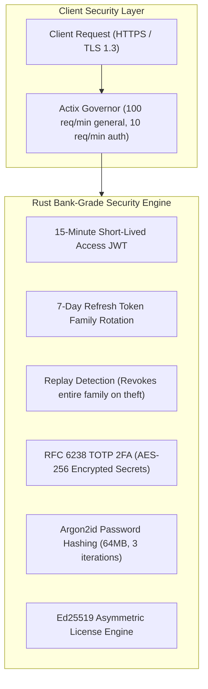
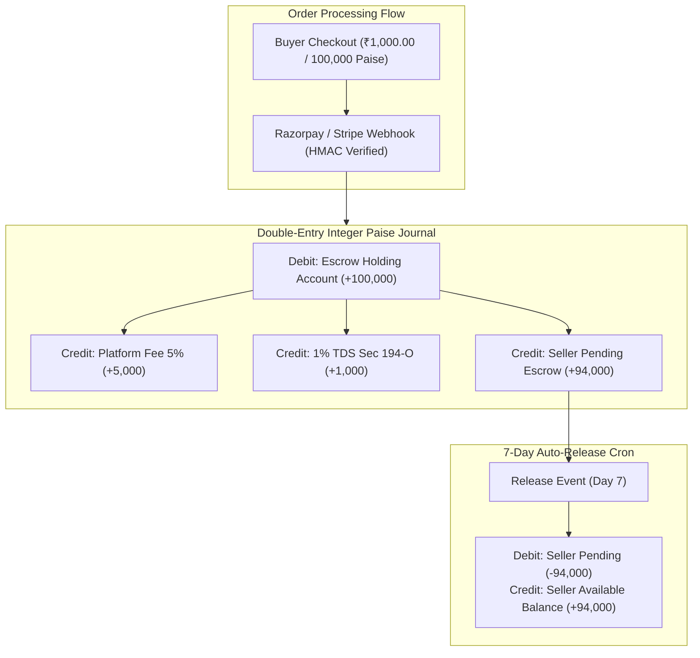
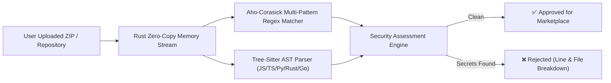

# 🛠️ KodeDock Technical Requirements Document (TRD)
**Document Version:** 1.0.0  
**Status:** Approved / Base Technical Specification  
**Target Systems:** Core Rust Backend Engine, PostgreSQL 16 (pgvector), Redis 7, SeaweedFS S3, Next.js 15 Web  
**Scale Target:** 5,000,000+ (5M+) Concurrent Users | Zero Server Crash  
**Author / Architect:** DeepMind Advanced Engineering Team & Lead Architect  

---

## 1. System Engineering & Runtime Specifications

### 1.1 Core Backend Runtime (Rust)
* **Compiler & Edition:** Rust 1.80+ (Edition 2021).
* **Async Runtime:** `tokio` 1.39+ with multi-threaded work-stealing scheduler (`rt-multi-thread`).
* **Web Framework:** `actix-web` 4.9+ (Actor-less high-throughput HTTP/1.1 & HTTP/2 engine).
* **Database Driver:** `sqlx` 0.8+ with native async PostgreSQL pool, prepared statement caching, and compile-time query verification.
* **Concurrency Model:** Lock-free / Bounded asynchronous message queues (`tokio::sync::mpsc::channel(1024)`) to enforce strict backpressure and prevent Out-Of-Memory (OOM) crashes under traffic spikes.

### 1.2 Data Storage & Cache Layer
* **Primary Relational DB:** PostgreSQL 16.x.
  - **Vector Extension:** `pgvector` v0.7+ for high-speed HNSW (Hierarchical Navigable Small World) cosine distance indexing (`vector(1536)`).
  - **Connection Pool:** SQLx pool bounded at 50 connections per instance (with Supavisor / PgBouncer multiplexing for 5M user scale).
  - **Encoding & Collation:** UTF-8, `C.UTF-8`.
* **In-Memory Cache & Message Broker:** Redis 7.2+ Alpine.
  - **Persistence:** Append-Only File (`AOF`) enabled every 1 second.
  - **Eviction Policy:** `volatile-lru` (Token blacklists and session caches expire automatically).
* **Object Storage Engine:** SeaweedFS / MinIO / Cloudflare R2.
  - **Protocol:** 100% Amazon S3 API compliant (`PutObject`, `GetObject`, `CreateMultipartUpload`, `UploadPart`, `PresignedURL`).
  - **Mount Point:** `/data/storage` (maps to Oracle 200GB block volume or external 1TB/100TB NAS).

### 1.3 Web & Frontend Runtime
* **Framework:** Next.js 15.x (App Router with React 19).
* **Language:** TypeScript 5.5+ (Strict mode enabled).
* **Bundle Optimization:** `output: 'standalone'` generating minimal production Docker images (< 45MB RAM).
* **Styling:** Tailwind CSS v4 with Shadcn UI (Radix UI accessible primitives).

---

## 2. Security, Cryptography & Authentication Specifications


```mermaid
graph TD
    subgraph Client_Security ["Client Security Layer"]
        REQ["Client Request (HTTPS / TLS 1.3)"]
        RATELIM["Actix Governor (100 req/min general, 10 req/min auth)"]
    end

    subgraph Auth_Engine ["Rust Bank-Grade Security Engine"]
        JWT["15-Minute Short-Lived Access JWT"]
        ROT["7-Day Refresh Token Family Rotation"]
        REUSE["Replay Detection (Revokes entire family on theft)"]
        TOTP["RFC 6238 TOTP 2FA (AES-256 Encrypted Secrets)"]
        ARGON["Argon2id Password Hashing (64MB, 3 iterations)"]
        DRM["Ed25519 Asymmetric License Engine"]
    end

    REQ --> RATELIM
    RATELIM --> Auth_Engine
```

### 2.1 Password Security (Argon2id)
* **Algorithm:** Argon2id (OWASP recommended standard).
* **Parameters:**
  - Memory Cost: $65,536\text{ KiB}$ (64 MB)
  - Time Iterations: $3$
  - Parallelism: $4\text{ threads}$
  - Salt Length: $16\text{ bytes}$ generated from cryptographically secure RNG (`rand::rngs::OsRng`).

### 2.2 Token Architecture & Family Rotation
* **Access Tokens:**
  - Lifespan: $15\text{ minutes}$.
  - Signature: HMAC-SHA256 (`HS256`) or Ed25519 (`EdDSA`).
  - Payload: `{ sub: UUID, role: "buyer"|"seller"|"admin", exp: Timestamp, jti: UUID }`.
  - Blacklist Check: Checked against Redis set on logout (`TTL = remaining exp`).
* **Refresh Tokens:**
  - Lifespan: $7\text{ days}$.
  - Storage: SHA-256 hashed in database (`refresh_tokens` table); plaintext token sent only via `HttpOnly`, `Secure`, `SameSite=Strict` cookie.
  - **Family Rotation Logic:**
    1. Every refresh request consumes the existing token and generates a new token belonging to the same `family_id`.
    2. If an already-consumed token is presented (indicating token interception/theft), the entire token family is immediately purged from the database, all active sessions for that user are revoked, and a security alert email is dispatched.

### 2.3 Two-Factor Authentication (TOTP 2FA)
* **Standard:** RFC 6238 (HMAC-based One-Time Password).
* **Time Step:** 30 seconds with 1-step drift window tolerance ($t-1, t, t+1$).
* **Secret Storage:** Base32 secret key is encrypted at rest in PostgreSQL using **AES-256-GCM** with a 96-bit initialization vector (IV) derived from the master encryption key.
* **Mandatory Enforcements:** Required for changing payout bank accounts, changing UPI IDs, and executing withdrawals $> ₹10,000$.

### 2.4 Cryptographic DRM Licensing (Ed25519)
* **Key Pair:** Master Ed25519 Private Key (stored in secure environment) + Public Key embedded in SDKs.
* **License Payload:**
  $$\text{Payload} = \{\text{product\_id}, \text{buyer\_id}, \text{tier}, \text{issued\_at}, \text{expires\_at}\}$$
* **Signature:** $\text{Sig} = \text{Ed25519\_Sign}(\text{PrivateKey}, \text{Payload})$.
* **Output Format:** Base58 / Base64 URL-safe armored string.
* **Verification:** Offline client verification via $\text{Ed25519\_Verify}(\text{PublicKey}, \text{Payload}, \text{Sig})$ requiring zero backend API calls.

---

## 3. Fintech & Double-Entry Ledger Specifications


```mermaid
graph TD
    subgraph Order_Flow ["Order Processing Flow"]
        BUYER["Buyer Checkout (₹1,000.00 / 100,000 Paise)"]
        RAZORPAY["Razorpay / Stripe Webhook (HMAC Verified)"]
    end

    subgraph Ledger_Journal ["Double-Entry Integer Paise Journal"]
        ESCROW["Debit: Escrow Holding Account (+100,000)"]
        FEE["Credit: Platform Fee 5% (+5,000)"]
        TDS["Credit: 1% TDS Sec 194-O (+1,000)"]
        SELLER_PEND["Credit: Seller Pending Escrow (+94,000)"]
    end

    subgraph Release_Cron ["7-Day Auto-Release Cron"]
        RELEASE["Release Event (Day 7)"]
        SELLER_AVAIL["Debit: Seller Pending (-94,000)<br>Credit: Seller Available Balance (+94,000)"]
    end

    BUYER --> RAZORPAY
    RAZORPAY --> Ledger_Journal
    ESCROW --> FEE
    ESCROW --> TDS
    ESCROW --> SELLER_PEND
    SELLER_PEND --> RELEASE
    RELEASE --> SELLER_AVAIL
```

### 3.1 Integer Arithmetic (Paise / Cents Precision)
* **Rule:** Floating-point data types (`FLOAT`, `DOUBLE`, `REAL`) are strictly prohibited in financial tables and Rust data structures.
* **Data Type:** `BIGINT` (`i64` in Rust).
* **Conversion:** $1\text{ INR} = 100\text{ Paise}$, $1\text{ USD} = 100\text{ Cents}$.

### 3.2 Double-Entry Journal Invariant
Every transaction must write balancing entries to `ledger_entries`:
$$\sum \text{Debits} - \sum \text{Credits} = 0$$

### 3.3 Concurrency & Double-Spend Protection
All balance modifications must execute inside an explicit database transaction using row-level locking:
```sql
-- Atomic lock on user balance account
SELECT id, available_balance_paise, pending_escrow_paise 
FROM user_accounts 
WHERE user_id = $1 
FOR UPDATE;
```

### 3.4 Webhook Idempotency Specification
* **Signature Verification:** Razorpay HMAC-SHA256 signature calculated over raw request body:
  $$\text{HMAC}(\text{secret}, \text{raw\_body}) == \text{header}["\text{X-Razorpay-Signature}"]$$
* **Replay Prevention:** Unique constraint on `webhook_events(provider, event_id)`. If an event ID already exists in the database, the server immediately returns `HTTP 200 OK` without re-processing ledger updates.

---

## 4. Tax Compliance & Invoicing Engine Specifications

### 4.1 Section 194-O TDS (Indian Income Tax)
* **Rate:** Exactly 1.0% ($100\text{ basis points}$) deducted on gross transaction value for Indian resident sellers.
* **Calculation:**
  $$\text{TDS Amount (Paise)} = \left\lfloor \frac{\text{Gross Amount (Paise)} \times 100}{10000} \right\rfloor$$
* **Reporting:** Aggregated in `tds_records` table with Seller PAN number for automated quarterly Form 16A preparation.

### 4.2 Goods & Services Tax (GST) Calculation
* **Digital Services HSN/SAC Code:** `998431` (Online digital content & software distribution).
* **Tax Rules:**
  1. *Intrastate (Seller State == Buyer State):* $9\%\text{ CGST} + 9\%\text{ SGST}$.
  2. *Interstate (Seller State != Buyer State):* $18\%\text{ IGST}$.
  3. *Export (Overseas Buyer):* $0\%\text{ Zero-Rated GST}$.
* **Invoicing:** Compliant PDF invoices generated in Rust using `printpdf` with sequential financial year invoice numbers (e.g. `KD/2026-27/00001`).

---

## 5. Storage & High-Speed S3 Direct Streaming Specifications

### 5.1 Direct Presigned Upload Protocol
1. Client requests upload ticket via `POST /api/v1/storage/upload-ticket`.
2. Rust validates authentication and generates a Presigned S3 Multipart Upload URL with a 30-minute expiry.
3. Client streams chunks (5MB - 50MB per part) directly to SeaweedFS / Cloudflare R2 using standard HTTP `PUT`.
4. Rust backend server experiences **0 MB RAM consumption and 0 MB bandwidth load** during the entire transfer.

### 5.2 Private Vault & Temporary Download Tokens
* **Storage Bucket:** `kodedock-vault-deliverables` configured with private ACL and server-side encryption (`AES-256`).
* **Download Access:** `GET /api/v1/marketplace/products/{id}/download`.
  - Verifies user ownership in PostgreSQL.
  - Issues a 15-minute temporary presigned `GetObject` URL with `Content-Disposition: attachment; filename="..."`.

### 5.3 Streaming Buffer Size
When proxying or processing files through the server, data is read and written in **64 KiB chunks** (`tokio::io::AsyncReadExt::read_buf`):
$$\text{Buffer Size} = 65,536\text{ bytes}$$

---

## 6. Code Security & AST Secret Scanner Specifications


```mermaid
graph LR
    ZIP["User Uploaded ZIP / Repository"] --> STREAM["Rust Zero-Copy Memory Stream"]
    STREAM --> REGEX["Aho-Corasick Multi-Pattern Regex Matcher"]
    STREAM --> AST["Tree-Sitter AST Parser (JS/TS/Py/Rust/Go)"]
    REGEX --> REPORT["Security Assessment Engine"]
    AST --> REPORT
    REPORT -->|Clean| PASS["✅ Approved for Marketplace"]
    REPORT -->|Secrets Found| FAIL["❌ Rejected (Line & File Breakdown)"]
```

### 6.1 Secret Detection Signatures
* **AWS Access Key:** `\b(AKIA|ABIA|ACCA|ASIA)[0-9A-Z]{16}\b`
* **Stripe Live Secret:** `\bsk_live_[0-9a-zA-Z]{24,}\b`
* **Private RSA/EC/SSH Keys:** `-----BEGIN [A-Z ]*PRIVATE KEY-----`
* **GitHub Tokens:** `\b(ghp|gho|ghu|ghs|ghr)_[0-9a-zA-Z]{36}\b`
* **Database Connection Strings:** `\b(postgres|mysql|mongodb|redis):\/\/[^\s:]+:[^\s@]+@[^\s\/:]+`

### 6.2 AST Vulnerability Patterns (Tree-Sitter)
* Detects dynamic un-sanitized code execution: `eval()`, `Function()`, `child_process.exec()`, `os.system()`, `subprocess.Popen(shell=True)`.
* Detects obfuscated Base64 decode payloads executing immediately in memory.

---

## 7. Realtime WebSockets & Cron Workers Specifications

### 7.1 WebSockets Connection Pool
* **Protocol:** WebSocket RFC 6455 over TLS (WSS).
* **Heartbeat:** Ping/Pong frames sent every $30\text{ seconds}$; client connection terminated if pong is missing after $10\text{ seconds}$.
* **Clustering:** Redis Pub/Sub backplane (`kodedock:ws:channel:{userId}`) enabling transparent horizontal message routing across multiple Rust backend instances.

### 7.2 Distributed Cron Schedules (Redis Redlock)
* **Escrow Auto-Release:** `*/15 * * * *` (Runs every 15 minutes; queries `escrow_transactions` where `release_due_at <= NOW()` and `status = 'held'`).
* **Session Purge:** `0 0 * * *` (Runs daily at 00:00 UTC; deletes revoked tokens and expired shopping carts).
* **Tax Reconciliation:** `0 1 * * *` (Runs daily at 01:00 UTC; validates daily ledger balance).

---

## 8. API Performance SLA & Quality Metrics

| Parameter | Target Metric | Enforcement Mechanism |
| :--- | :--- | :--- |
| **P95 Read Latency** | **< 5 ms** | SQLx prepared query cache + Redis caching |
| **P99 Read Latency** | **< 15 ms** | Non-blocking async I/O in Tokio |
| **P95 Write Latency** | **< 10 ms** | ACID row-level locking + async indexing |
| **Vector Search Latency** | **< 8 ms** | `pgvector` HNSW cosine distance index |
| **Backend Memory Footprint** | **< 60 MB RAM** | Zero Garbage Collection (Rust borrow checker) |
| **Container Cold-Start** | **< 300 ms** | Native compiled ELF binary in Alpine/Debian |
| **Uptime SLA** | **99.99%** | Multi-replica health checks & Caddy failover |
