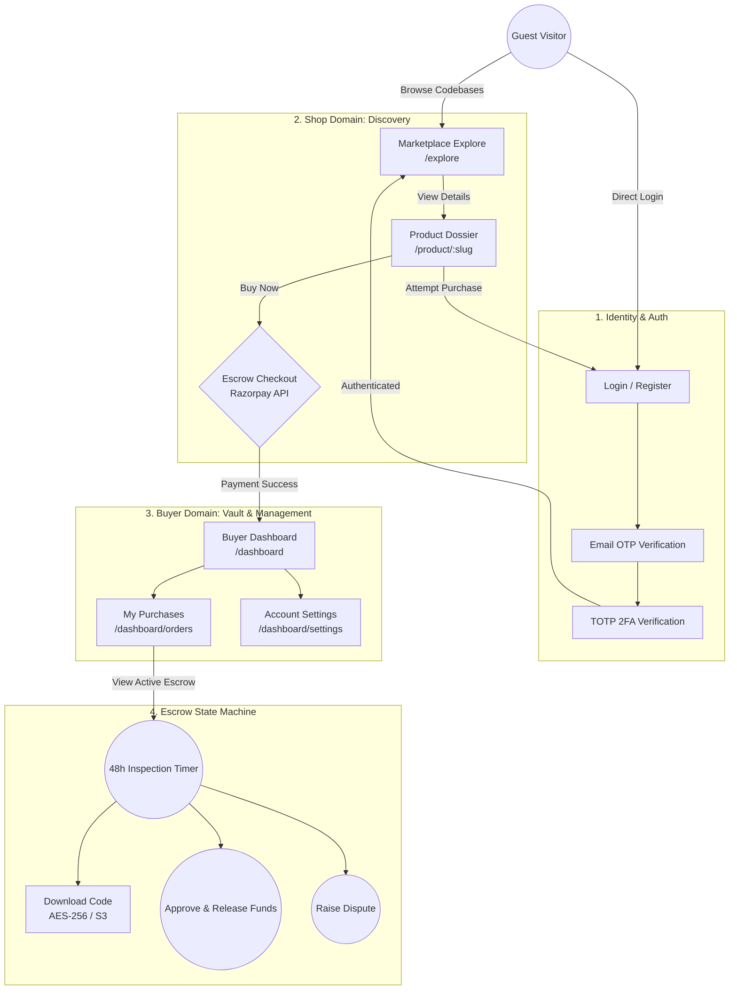

# 🛒 KodeDock Buyer Application Flow

This document outlines the complete end-to-end user journey for a Buyer on the KodeDock platform. It defines what pages exist, why they exist, and how they connect to ensure a secure, zero-mock, Bank-Grade Escrow experience.

---

## 🗺️ 1. Complete Buyer Visual Flow Diagram

---

## 📑 2. Page Breakdown: Kya Hona Chahiye Aur Kyon?

### 1. The Shop Domain `(shop)`
Yahan buyer aakar codebases discover karta hai aur kharidta hai.

- **`/explore` (Marketplace Catalog):**
  - **Kya hai:** Ek highly visual grid jahan saare verified codebases list honge.
  - **Kyon hai:** Taki buyer ko platform par available top-tier codebases (Next.js, Rust, Go, etc.) search, filter, aur sort karne me aasani ho.

- **`/product/[slug]` (Product Dossier):**
  - **Kya hai:** Kisi bhi codebase ka detailed technical specification page. Yahan AST Security audit score, tech stack, aur Escrow Checkout button hoga.
  - **Kyon hai:** Buyer kharidne se pehle transparency chahta hai. Use pata hona chahiye ki backend me kaunsa architecture use hua hai aur usme koi leaked secrets toh nahi hain.

### 2. The Auth Domain `(auth)`
Security is the top priority for KodeDock.

- **`/login` & `/register`:**
  - **Kyon hai:** Buyer ki identity verify karne ke liye aur TFR (Token Family Rotation) generate karne ke liye.
- **`/verify-2fa`:**
  - **Kyon hai:** KodeDock financial escrow system par based hai. Kisi bhi high-risk purchase ya login ke liye Bank-Grade RFC 6238 TOTP verification zaruri hai.

### 3. The Buyer Domain `(buyer)`
Ye buyer ka private, secure vault hai jahan wo apne kharide hue assets manage karega.

- **`/dashboard` (Overview):**
  - **Kya hai:** Ek high-level overview. Active escrows ka snapshot, recent purchases, aur total funds spent.
  - **Kyon hai:** Taki buyer jab bhi login kare, use instantly pata chal jaye ki kaunse codebase ki inspection 48 hours me expire hone wali hai.

- **`/dashboard/orders` (Purchases & Escrow Vault):**
  - **Kya hai:** Ye sabse important section hai. Yahan buyer ko har kharide gaye codebase ka "State Machine" dikhega.
  - **Kyon hai:** 
    1. **Download Code:** Buyer S3 se AES-256 encrypted source code download karega.
    2. **48h Countdown Timer:** Buyer ko ek live timer dikhega.
    3. **Approve Escrow:** Agar code theek hai, toh buyer funds early release kar sakta hai (Seller ko payout).
    4. **Raise Dispute:** Agar AST scan galat tha ya code kaam nahi kar raha, toh buyer funds freeze (Dispute) kar sakta hai.

- **`/dashboard/settings` (Profile & Security):**
  - **Kya hai:** User profile, billing details (GST Invoice defaults), aur 2FA settings.
  - **Kyon hai:** Buyer ko apna password change karne ya nayi TOTP key setup karne ke liye ek secure interface chahiye.

---

## 🔗 3. Connection Logic (Kaise Connect Rahega?)

1. **Unauthenticated Flow:**
   - Ek naya guest `/explore` par aayega, `/product/saas-boilerplate` dekhega. Agar usko pasand aaya aur usne `Buy` par click kiya, toh wo immediately `/login` par redirect hoga.
2. **Authenticated Checkout Flow:**
   - Login karne ke baad, wo wapas `/product/saas-boilerplate` par aayega.
   - Payment (Checkout) hone ke baad, database me Double-Entry Ledger update hoga, aur buyer automatically `/dashboard` par chala jayega jahan use apna order dikhega aur 48-hour timer chalu ho jayega.
3. **Escrow Validation Flow:**
   - `/dashboard/orders` me jaakar buyer `Download Code` click karega.
   - Pura system securely Rust backend (`src/storage` and `src/fintech`) se juda hoga jo ensure karega ki sirf wahi buyer download kar sakta hai jisne paise diye hain (Zero Mock).
